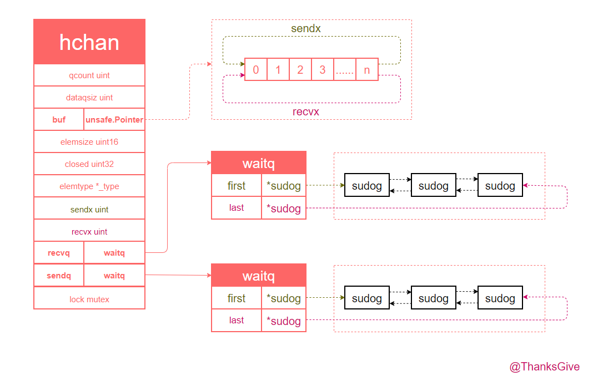

# Go 的 Channel

## Go 的 CSP 模型

Go 语言中的并发模型是基于 Communicating Sequential Processes (CSP) 的。这种模型由计算机科学家 Tony Hoare 在 1978 年提出，是一种并发编程的理论模型，用于描述并发系统中的组件如何通过消息传递进行通信和协作。

Go 语言通过 Goroutine 和 Channel 结合的方式实现了 CSP 模型。

## 1、CSP 模型的核心概念
* 1、进程(Process): 在 CSP 中，进程是独立的执行单元，彼此并行运行，且不共享内存。每个进程都封装了它的执行逻辑和状态。
* 2、通信(Communication): 进程之间通过消息传递（Channel）进行通信，而不是通过共享内存。CSP 模型强调进程之间的通信是同步的，即发送方和接收方在消息传递时必须同时到达，才能完成消息的传递。
* 3、同步(Synchronization): CSP 强调进程之间通过通信来同步彼此的行为。当一个进程向另一个进程发送消息时，它会等待，直到接收方准备好接收消息。

## 2、Go 的 CSP 模型

***Go 语言通过 Goroutine 和 Channel 来实现 CSP 模型。***

### Go 的 CSP 模型的核心概念
* 1、Goroutine
* * 1.1、Goroutine 是 Go 中的轻量级线程，使用 go 关键字启动。每个 Goroutine 是一个独立的执行单元，它们之间相互独立，可以并发运行。由于 Goroutine 是由 Go 运行时管理的，因此 Goroutine 比系统线程更轻量级。
* * 1.2、Goroutine 通过非共享内存的方式实现并发，即每个 Goroutine 拥有自己的栈和执行上下文。通过 Goroutine，可以轻松地创建和管理成千上万的并发任务。
* 2、Channel
* * 2.1、***Channel*** 是 Go 中用于在 Goroutine 之间传递数据的通信机制。Channel 提供了一种类型安全的方式来在 Goroutine 之间传递消息。它类似于一个管道，一端用于发送数据，另一端用于接收数据。
* * 2.2、Channel 可以是有缓冲的或无缓冲的：
* * * 2.2.1、***无缓冲 Channel***：发送方和接收方必须同时准备好，才能进行通信。这种 Channel 实现了 CSP 模型中的同步通信。
* * * 2.2.2、***有缓冲 Channel***：发送方可以将数据写入 Channel，而无需等待接收方立即接收。缓冲区满时，发送方才会阻塞等待。

### Go 的 CSP 模型的优势
* 1、***避免共享内存***：CSP 模型通过消息传递避免了多个 Goroutine 共享内存，减少了并发编程中常见的竞争条件和锁的使用。
* 2、***简化并发编程***：通过 Goroutine 和 Channel，Go 提供了简洁的并发编程方式，使得开发者可以以更自然的方式编写并发代码。
* 3、***高效调度***：Go 运行时高效地调度 Goroutine，使得在多核处理器上可以充分利用计算资源。

### Go 的并发哲学

***不要通过共享内存进行通信。建议，通过通信来共享内存。***  
  

相对于使用 sync.Mutex 这样的并发原语。虽然大多数锁的问题可以通过 channel 或者传统的锁两种方式之一解决，但是 Go 语言核心团队更加推荐使用 CSP 的方式。

Go 的同步原语主要可分为两大类：
* 1、sync 包(Mutex、RWMutex、WaitGroup、atomic 等等)
* * sync 包的使用场景：
* * * 1.1、读写共享资源：如果多个 goroutine 需要读写共享资源(如 共享变量、数据结构 等)，那么 sync.Mutex 可以用于保护这些资源；
* * * 1.2、简单的互斥需求：当你仅仅需要确保某段代码在任何时候只被一个 goroutine 执行时
* * * 1.3、在某些性能敏感的场景下，sync.Mutex 通常会比 Channel 更高效，因为它可以避免通道的额外开销
* 2、Channel
* * Channel 包的使用场景：
* * * 2.1、消息传递：通过 goroutine 之间需要传递消息或数据时，Channel 是第一选择
* * * 2.2、同步：Channel 可以用来实现复杂的同步机制，例如：等待一组 goroutine 完成某项任务，或协调多个 goroutine 的工作进度
* * * 2.3、生产者-消费者：利用 Channel，可以轻松实现
* * * 2.4、事件通知：Channel 可以用来实现事件通知机制，比如 通知某个 goroutine 某个事件已经发生

而以上就是有关 CSP 模型的概念 以及 定位 Channel 的使用场景。随后我们将开始详解 Channel 了。

## 3、Channel 的数据结构

源码：src/runtime/chan.go

让我们还是先解析一下注释：第 7 行 --- 第 18 行

* 1、第一组不变性条件(适用于所有通道)
* * 1.1、至少一个队列是空的
* * * 1.1.1、c.sendq 表示 发送队列，存储等待 发送数据的 goroutines
* * * 1.1.2、c.recvq 表示 接收队列，存储等待 接收数据的 goroutines
* * 1.2、无缓冲通道的例外情况：
* * * 1.2.1、对于 无缓冲通道(unbuffered channel)，存在一种特殊情况，当一个 goroutine 在使用 select 语句同时阻塞在 发送 和 接收 操作上时，在这种情况下，c.sendq 和 c.recvq 的长度仅受限于 select 语句中分支的数量
* 2、第二组不变性条件(适用于缓冲通道，对于缓冲通道(buffered channels)，还需额外满足以下条件)
* * 2.1、c.qcount > 0 意味着 c.recvq 是空的
* * * 2.1.1、c.qcount 表示缓冲区中当前存储的数据项数量
* * * 2.1.2、如果 c.qcount > 0，即缓冲区中有数据，那么意味着没有 goroutine 在接收队列中等待接收数据
* * * 2.1.3、这是因为一旦缓冲区有数据可读的话，那么接收操作就可以立即从缓冲区中读取数据而不会被阻塞，因此 c.recvq 应该是空的
* * 2.2、c.qcount < c.dataqsiz 意味着 c.sendq 是空的
* * * 2.2.1、c.dataqsiz 表示通道缓冲区的总大小
* * * 2.2.2、如果 c.qcount < c.dataqsiz，即缓冲区未满，那么意味着没有 goroutine 在发送队列中等待
* * * 2.2.3、因为一旦缓冲区未满，发送操作就可以立即将数据写入缓冲区而不会被阻塞，因此 c.sendq 应该是空的

```go
type hchan struct {
	qcount   uint           // 队列中的总数据量，表示当前缓冲区中存储的数据项数量
	dataqsiz uint           // 循环队列的大小，指定缓冲区的容量，即缓冲通道可以容纳的数据项数
	buf      unsafe.Pointer // 指向一个大小为 dataqsiz 的元素数组（该数组为实际存储数据的缓冲区）的指针
	elemsize uint16 // 每个元素的大小，以字节为单位
	closed   uint32 // 通道是否已关闭的标志(非零值表示通道已关闭，零值表示通道仍然打开)
	elemtype *_type // 元素类型
	sendx    uint   // 发送索引(指示下一个应写入缓冲区的位置，是一个循环队列的索引)
	recvx    uint   // 接收索引(指示下一个应从缓冲区中读取的位置，是一个循环队列的索引)
	recvq    waitq  // 接收等待队列(保存正在等待接收数据的 goroutine 列表，当通道没有数据可读时，这些 goroutine 会被阻塞在这里)
	sendq    waitq  // 发送等待队列(保存正在等待发送数据的 goroutine 列表，当通道没有空闲空间可以写入时，这些 goroutine 会被阻塞在这里)

	/* 
        这个锁不仅仅保护着 hchan 中的全部字段，还保护由于这个 channel 阻塞的 Goroutine(也就是 sudog 结构体)的一些字段

        同时，需要强调的是，在持有这个锁的时候，不要去修改其他 Goroutine 的状态，尤其不要将其他 Goroutine 标记为 "ready"，否则可能会导致与栈缩减操作(stack shrinking)之间的死锁问题
    */
	lock mutex
}
```

这里说明一下，lock字段 为什么可能会导致死锁的原因：
* Golang 的调度器有一个 栈缩减机制(stack shrinking)，用于在检测 Goroutine 占用了过多未使用的栈空间时，缩减其栈空间以节省内存。
* 例如：在 GoroutineA ***持有一个锁期间*** 尝试改变另一个 GoroutineB 的状态(特别是使其变为 "ready" 状态 - 准备运行)，***而这个 GoroutineB 很可能正处于栈缩减过程***，可能会引发 死锁。
* ***因为栈缩减过程需要暂停目标 GoroutineB 并获得相应的锁，如果这个时候当前 GoroutineA 持有的锁正好是栈缩减需要的，那么两个 Goroutine 就会互相等待对方释放锁，导致死锁***

```go
    // 等待队列
    /* 
    双指针实现队列
    1、通过使用两个指针 first 和 last，可以高效地实现 插入 和 删除 操作，其中 first 用于指向队列的头部，last 用于指向队列的尾部
    2、队列是一个先进先出(FIFO)的数据结构，所以从头部出队，从尾部入队
    */
    type waitq struct {
	    first *sudog // 指向等待队列中的第一个元素(即头部) 
	    last  *sudog // 指向等待队列中的最后一个元素(即尾部)
    }
```

```go
/* 
    1、sudog 在 Go runtime 中用于表示等待列表中的 Goroutine，sudog 是调度器用来管理和跟踪阻塞的 Goroutine 的数据结构，例如在通道上发送或接收数据。
    2、多对多关系：
        2.1、一个 goroutine 可以在多个等待列表中等待，因此一个 goroutine 可能对应多个 sudog 实例；
        2.2、同时，多个 goroutine 可能在等待同一个 同步对象，例如 一个通道，所以一个同步对象也可能对应多个 sudog 实例；
        2.3、必要性：由于这种多对多关系，sudog 结构是必需的，用于有效地管理这些等待关系
    3、内存管理：
        3.1、特殊池：sudog 结构体从一个特殊的内存池中分配，这意味着 sudog 的创建和销毁通过预先分配好的内存块来高效地进行
        3.2、分配 与 释放：
            3.2.1、acquireSudog: 用于从池中分配一个 sudog 实例
            3.2.2、releaseSudog: 用于将 sudog 实例释放回池中，以便重复利用
*/
type sudog struct {
	// 1、以下字段由当前 sudog 所阻塞的 通道 的 hchan.lock(即 通道锁)的保护，
	// 2、shrinkstack 依赖于 hchan.lock 来确保对 sudog 字段的正确同步(换言之，shrinkstack 操作涉及到处理通道中的 sudog 时，它将依赖于通道锁来保证这些字段的安全访问)。

	g *g // 指向正在等待的 Goroutine 对象

	next *sudog // 用于指向下一个 sudog，组成双向链表
	prev *sudog // 用于指向上一个 sudog，组成双向链表
	elem unsafe.Pointer // 指向实际的数据元素，这可能是一个指向栈上的数据指针。

    /* 
        接下来的这些字段不会被并发访问。
        对于 通道(Channel)，waitlink 字段仅由 goroutine(g) 自己访问
        对于 信号量(semaphores)，当 sudog 用于信号量操作时，所有字段的访问都需要持有 semaRoot 锁
    */

	acquiretime int64 // 记录 sudog 被分配(即 Goroutine 开始等待)的时间
	releasetime int64 // 记录 sudog 被释放(即 Goroutine 不再等待)的时间
	ticket      uint32 // 用于同步机制，如 信号量擦欧总，可以作为一个唯一标识 或 排序值

    /* 
        isSelect 这个字段指示当前的 goroutine 正在参与一个 select 操作。
        因此，必须通过 CAS 操作来设置 g.selectDone，以此来帮助赢得唤醒竞态。

        唤醒竞态问题：
            唤醒竞态：在并发环境中，当多个 goroutine 被同时唤醒时，可能会发生竞态条件，即多个 goroutine 同时竞争一次唤醒事件；
            g.selectDone：这是与 goroutine 关联的一个字段，用于标记 select 操作是否已经完成
        
        使用 CAS 的操作来解决竞态问题：
            CAS(Compare-And-Swap): 一种原子操作，用于比较并交换值。具体来说，如果当前值等于预期值，则将其替换为新值。这种操作可以防止竞态条件。 
            必要性: 在 select 操作中，为了确保只有一个 goroutine 能够赢得唤醒竞争，需要对 g.selectDone 字段使用 CAS 操作。
    */
	isSelect bool // 表示这个 Goroutine 是否参与了 select 操作。如果 是，那么在唤醒竞争中需要使用 CAS 来确保 g.selectDone 的正确性

    /* 
        success 表示通过 通道(channel c) 的通信是否成功，
        如果 goroutine 因为有值通过通道 c 而被唤醒，则为 true。
        如果 goroutine 因为通道 c 被关闭 而被唤醒，则为 false。
    */
	success bool

	parent   *sudog // 用于在信号量的二叉树中的父节点
	waitlink *sudog // 链接到下一个等待的 Goroutine 或者 semaphore 根
	waittail *sudog // 在信号量根中指向最后一个等待项
	c        *hchan // 表示当前阻塞的 channel。hchan 是 Go runtime 中 channel 的内部表示形式
}
```
