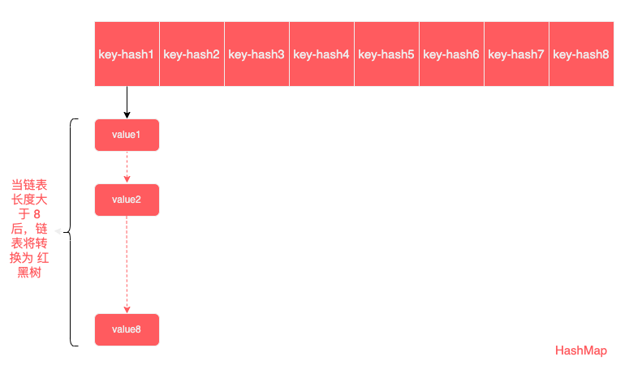
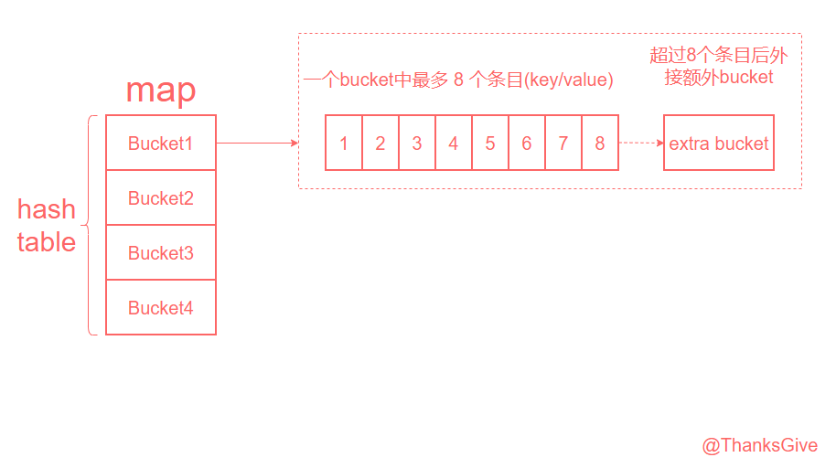
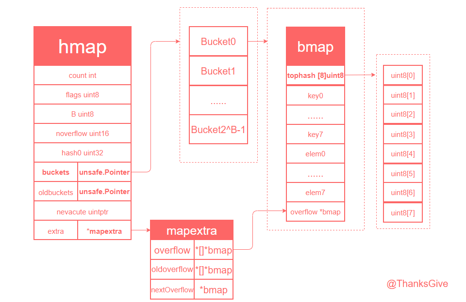
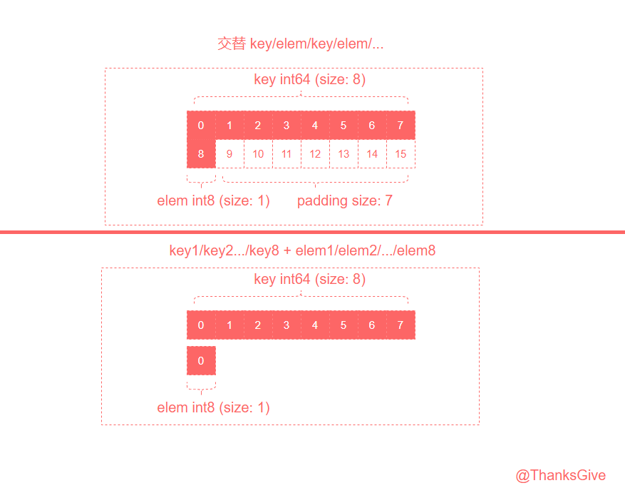

# Go Map 源码解析

在我们开始对 map 的源码进行解析前，我想先梳理一些有关 map 的额外信息，希望的是能有助于阅者们少走弯路。
* 1、基于 map 的 Go 源码版本路径差异：
* * 1.1、Go1.10 及 以下版本的 map 源码路径：src/runtime/hashmap.go
* * 1.2、Go1.11 及 以上版本（目前截止到 Go1.23）的 map 源码路径：src/runtime/map.go
* 2、map 的 make 初始化创建的底层源码实现，是有两套方案：
* * 2.1、小容量 map 的初始化：func makemap_small() *hmap
* * 2.2、大容量 map 的初始化：func makemap(t *maptype, hint int, h *hmap) *hmap

***Now that the digression is over, let’s get back to the point.***

## map 的数据结构
说起 map 这个概念，那就不得不提起国内版本中永远的“八股文之王”了，java 的 HashMap(jdK8)。虽说 java 因为 Oracle 的付费操作，而让国内的玩家们长期停滞于 JDK8 的版本。但我们也不得不承认，HashMap 的底层设计堪称一代经典之作。如果你已经有了对 HashMap 的了解，那么关于 Go map 的设计理念将会更容易去理解。没有也无妨，我们简单描述一下 HashMap 的数据结构，也算为 Go map 做个铺垫。

HashMap(jdk8) 图解



* HashMap，它是以 key-value 的方式进行数据存储，在底层的构成上，是基于 数组+链表 的方式来实现；
* 存储上，根据 key 进行一个哈希运算，从而得到一个关于 key 的 hash值。通过这个 hash值 来定位 key-value 在数组上的存储位置。理想情况下，自然是一个 hash值 只占一个位置。但现实往往是不遂人愿的，哈希运算的结果不可避免的在大数据压力下会造成重复的 hash值，这样的结果就是，虽然 key 不一致，但运算后的 hash值 却是一样的，这样就会造成过失性的数据覆盖，也就是我们常说的 哈希冲突；
* 所以为了容错这一不可避免的 哈希冲突，在 map 中，key 的 hash值 相同时，会在对应的位置，延伸出一个 链表，用于存储 相同 hash值 的不同 key-value；
* other：从 java8 开始，当链表长度超过一定阈值( 链表长度大于 8 )时，会转换为 红黑树，用以提高性能。
---
在简单梳理了一下 HashMap 的设计想法后，我们可以简单地总结一下有关 map 的组成模块
* 1、存储数据的方式：key-value
* 2、用于定位底层存储位置的标识，哈希值，将 key 进行哈希运算而得到；
* 3、底层的数据结构组成：
* * 3.1、在没有 hash 冲突的理想情况下，就是一个 数组，也可以说是一个 哈希表；
* * 3.2、在存在 hash 冲突的现实情况下，数组 + 链表(或任意存储模块，只要能存放值，理论上都可以)；
---
基于上述简单总结，我们终于是可以打开源码的文件了，/src/runtime/map.go (当前 Go1.20 版本)

而在打开源码后，我们要做的第一步，并不是马不停蹄地开始阅读源码，如果你是第一次打开源码，相信我，你根本不知道从哪里开始起头阅读。而这个时候，我的建议是，从开头第一行开始，不用管它是什么，因为源码开发者就是如此地纯粹，任何源码中的存在都是具有价值的。哪怕你英文阅读不好，也不要怕，open 百度，open Google。

只要你细细阅读 map.go 的注释，你就会发现，其实关于 Go map 的设计想法，Google的大佬们早在一开始就说明了，只是 use English，而我们只需要将其翻译成中文即可。

以下为 map.go 第7行 --- 第31行的简略译文：
* map 只是一个 哈希表。数据被安排存储到一个 buckets(桶) 数组。每个 bucket 包含 8对 key/value。哈希的低位被用于选择一个 bucket，每个 bucket 都包含着 每个 哈希的几个高位，高位的意义是用于区分单个 bucket 内部的条目。
* 如果一个 bucket 中的条目超过了 8对 key/value， 我们会链接一个额外的 bucket。
* 当 哈希表扩容 时，我们会分配一个 两倍大的 新的 bucket 数组。而后将数据逐渐从 旧的bucket数组 复制到 新的bucket数组。
* Map 迭代器遍历 buckets 数组并按遍历顺序返回 key（先在 桶编号，然后是 溢出链顺序，最后是 桶内索引）。为了保持迭代语义，我们从不移动存储在桶内 keys 的位置（如果我们移动了，那么 keys 可能会返回 0 或 2 次）。当我们扩容表时，迭代器仍在旧表上进行迭代，如果他们正在遍历的桶已经被移动("evacuated")到新的哈希表中，则必须检测新的哈希表。
---
从上面的简略译文，我们也就了解到 Go map 的一个大致模型了：
* Go map 本质上是一个由 bucket 组成的 哈希表；
* 每个 bucket 最多包含 8 对 key/value;
* key 的 哈希值，分为 高位 和 低位，低位用于索引 bucket 的位置，高位用于区分 bucket内部的条目位置；
* bucket 内部超过 8对 key/value 后，额外链接一个 bucket；



是不是发现 Go map 和 HashMap 有那么一点儿相似的味道了。

而在做了这么多铺垫后，我们终于可以开始美妙的源码阅读时间了。

先让我们整合一下 map.go 中的结构体
* 1、hmap：Go map 的头部数据结构，包含了 map 的元数据 和 状态信息
* 2、bmap：Go map 的 bucket 数据结构，由四个部分组成，tophash 为 bmap 的结构体部分，其他三个组成部分为编译器在底层为其内存布局而预留的空间
* * 2.1、tophash [bucketCnt]uint8 : 存储每个 key 的哈希值的高字节(top byte)；
* * 2.2、然后续接 最多 bucketCnt 个 keys；
* * 2.3、然后续接 最多 bucketCnt 个 elems；
* * 2.4、最后额外接一个 overflow(溢出桶)指针；
* 3、mapextra：Go map 的额外信息

```go
// Go map 的头部
type hmap struct {
	// 笔记: hmap 的格式在 cmd/compile/internal/reflectdata/reflect.go. 中被编码
	// 请确保与编译器的定义保持一致
	count     int // # 活跃值 == map的容量.  必须在第一个 (被 len() 内建函数使用)
	flags     uint8 // 标记字段，用于存储与 map 状态相关的标记位
    
    /* 
        B 表示 桶数量的以2为底的对数。
        也就是说，桶数量是 2 的 `B` 次方。

        `loadFactor` 为预定义的常量或变量，用于调整哈希表的 负载因子
    */
	B         uint8  // log以2为底，桶数量的对数 (可以存储 loadFactor * 2^B 个元素)
	noverflow uint16 // 溢出桶的大致数量
	hash0     uint32 // 哈希种子

	buckets    unsafe.Pointer // 桶数量的指针，规模为 2^B 。如果 count==0，则可能为 nil
	oldbuckets unsafe.Pointer // 旧的桶数组指针，其大小为当前数组的一半，仅在扩展过程中非空。（ 在哈希表扩展(rehash)过程中，指向旧的桶数组。当新的桶数组正在填充时，这个字段保存旧的桶数组 ）
	nevacuate  uintptr        // 搬迁进度计数器（小于此数值的桶已经搬迁了）在扩展过程中，指示已经完成搬迁的桶的数量

	extra *mapextra // 额外字段（包含一些非必要但有用的信息，如 溢出桶的列表）
}
```

```go
// Go map 中的 bucket
type bmap struct {
    /* 
    译文：
        tophash 通常情况下，存储了 bucket 中每个 key 的哈希值的 高字节(top byte)。
        如果 tophash[0] < minTopHash，则 tophash[0] 表示这个桶正处于迁移(evacuation)状态
    */
	tophash [bucketCnt]uint8
    /* 
    译文：
        再接着，bucketCnt 个 keys，然后是 bucketCnt 个 elems。
        笔记：将所有 keys 打包放一起，然后把所有 elems 放一起。这样做的话，虽然使得代码比起交替 key/elem/key/elem/... 更为复杂。
            但它能消除因内存对齐需求而产生的填充空间，从而更高效地利用内存。例如：map[int64]int8。
        再接着是一个 overflow(溢出桶) 指针。
    */
}
```
```go
// Go map 的额外数据，并不是所有的 map 都需要的
type mapextra struct {
	/* 
    译文：
        1、当键和值不包含指针时，可以标记桶类型为不包含指针，从而避免垃圾回收器扫描这些桶
        2、尽管如此，桶本身的 overflow 字段是一个指针，为了保持这些溢出桶的存活，需要将它们的指针存储在 hmap.extra.overflow 和 hmap.extra.oldoverflow 中。
        3、overflow 和 oldoverflow 字段分别用于 当前哈希表的溢出桶 和 旧哈希表的溢出桶
        4、通过这种方式，可以在迭代器中灵活地管理和引用这些溢出桶
    */
	overflow    *[]*bmap // 指向当前哈希表的溢出桶的切片
	oldoverflow *[]*bmap // 指向旧哈希表的溢出桶的切片。这在哈希表扩容时使用，以保持对老桶的引用，直到所有的旧数据被搬移到新的桶中

	// nextOverflow holds a pointer to a free overflow bucket.
	nextOverflow *bmap // 指向一个空闲的溢出桶，用于快速分配新的溢出桶
}
```
在对源码中的 struct 进行解析后，我们可以将上面的粗略 Go map 图解进行细分。
* 1、hmap 作为 Go map 的头部信息，也是它的表侧结构体。其中字段 buckets 是 指向底层的哈希表的指针引用；
* 2、底层的 哈希表 是一个 bucket 数组，容量规模为 2^B;
* 3、bucket 的桶结构体是由 bmap 组成，bmap 的结构体虽然只有 tophash 一个字段，但编译器会将 keys、elems、overflow的指针在内存中逐次接续起来，从而形成一个 bucket 的整体内存布局；
* 4、bmap 中 keys 和 elems 的排列方式是：key1/key2.../key8 + elem1/elem2/.../elem8;
* 5、hmap.extra.overflow 指向 当前哈希表的溢出桶的切片


在解析完 Go map 的底层数据结构后，我们应该需要注意到几个优秀的特异点

***第一个特异点：存储方式上的差异***

那就是在 bucket 中 keys、elems 的存储布局

不是我们想象中的 交替 key/elem/key/elem/... 

***而是 key1/key2.../key8 + elem1/elem2/.../elem8***  

注释文中也有提及，这样的存储方式有利于消除 字节对齐 的影响，从而提高内存效用。同时Google 的大佬们也十分贴心地给出了一个例子：map[int64]int8，我们就以此来验证一下上述两种存储布局方式的内存大小吧

关于内存中的字节对齐的详解，可以阅读 [字节对齐](alignment.md) 进行了解

这里简单讲一下内存中的字节对齐，我们就以 map[int64]int8 的两种存储方式为例。

字节对齐：为了内存布局 和 数据读取的需要，指对不同类型的组合，在同一存储空间内要保证内存占用的一致性，而对齐的标准则是以 类型中字节占比最大者决定的，而字节占比不足者，则需要通过填充字节来进行补齐（本质上就是 空间换时间）。

* 1、交替 key/elem/key/elem/... 这样的方式，我们可以抽象为类似一个结构体
```go
type mapS struct {
	k int64
	v int8
}
```
* 2、key1/key2.../key8 + elem1/elem2/.../elem8 则可以理解为，分别使用 []int64 来存储 keys，使用 []int8 来存储 elems
```go
var keys []int64
var elems []int8
```

```go
type mapS struct {
	k int64
	v int8
}
func main() {
	a := mapS{}
	// 计算 map 的内存占用
	mapSize := unsafe.Sizeof(a)
	fmt.Println("mapSize : ", mapSize)

	fmt.Println("k-size: ", unsafe.Sizeof(a.k))
	fmt.Println("v-size: ", unsafe.Sizeof(a.v))
}
/* 
mapSize :  16
k-size:  8
v-size:  1
*/
```

---

***第二个特异点：bmap 的内存布局***
```go
// A bucket for a Go map.
type bmap struct {
	tophash [bucketCnt]uint8
}
```
单从源码中来看，bucket 的 结构体 bmap 不就是只有一个 tophash 字段嘛。为什么注释描述中却提及了，keys、elems、overflow 的存储了。说是编译器的底层实现，我们如何来证实呢？
```go

const bucketCntBits = 3
const bucketCnt = 1 << bucketCntBits

// A header for a Go map.
type hmap struct {
	count      int // # live cells == size of map.  Must be first (used by len() builtin)
	flags      uint8
	B          uint8          // log_2 of # of buckets (can hold up to loadFactor * 2^B items)
	noverflow  uint16         // approximate number of overflow buckets; see incrnoverflow for details
	hash0      uint32         // hash seed
	buckets    unsafe.Pointer // array of 2^B Buckets. may be nil if count==0.
	oldbuckets unsafe.Pointer // previous bucket array of half the size, non-nil only when growing
	nevacuate  uintptr        // progress counter for evacuation (buckets less than this have been evacuated)
	extra      *mapextra      // optional fields
}

// mapextra holds fields that are not present on all maps.
type mapextra struct {
	overflow     *[]*bmap
	oldoverflow  *[]*bmap
	nextOverflow *bmap
}

// A bucket for a Go map.
type bmap struct {
	tophash [bucketCnt]uint8
}

func main() {
	// 构建一个 Go map (刚好一个 满 bucketCnt 的 bucket)
	a := make(map[int]int, bucketCnt)
	for i := 0; i < bucketCnt; i++ {
		a[i] = i * 10
	}
	// 利用反射来获取 Go map 的头部信息 hmap
	val := reflect.ValueOf(a)
	hdr := (*hmap)(unsafe.Pointer(val.Pointer()))
	fmt.Printf("Map metadata: count=%d, flags=%d, B=%d, noverflow=%d, hash0=%d\n",
		hdr.count, hdr.flags, hdr.B, hdr.noverflow, hdr.hash0)
	fmt.Println("----------------------------------------------------------------------------------------------")
	// 遍历 bucket 并打印内容
	bucketSize := uintptr(unsafe.Sizeof(bmap{}))
	for i := 0; i < 1<<int(hdr.B); i++ {
		// hmap.buckets 为 底层buckets数组的指针。叠加 第i个 bucket结构体的size，从而获取第i个 bucket 的起始地址
		bucketAddr := uintptr(hdr.buckets) + bucketSize*uintptr(i)
		// 获取 bmap
		bucket := (*bmap)(unsafe.Pointer(bucketAddr))
		fmt.Printf("Bucket %d: tophash=%v\n", i, bucket.tophash)
		// keys 的起始地址 = bucket的起始地址 + tophash的size
		keysStart := bucketAddr + unsafe.Sizeof(bucket.tophash)
		// elems 的起始地址 = keys的起始地址 + keys的size
		elemsStart := keysStart + bucketCnt*unsafe.Sizeof(int(0))
		fmt.Println("keys: ")
		for j := 0; j < bucketCnt; j++ {
			key := *(*int)(unsafe.Pointer(keysStart + uintptr(j)*unsafe.Sizeof(0)))
			fmt.Printf("	key[%d]: %d\n", j, key)
		}

		fmt.Println("elems: ")
		for j := 0; j < bucketCnt; j++ {
			elem := *(*int)(unsafe.Pointer(elemsStart + uintptr(j)*unsafe.Sizeof(0)))
			fmt.Printf("	elem[%d]: %d\n", j, elem)
		}
		// 溢出桶的指针地址 = elems 的起始地址 + elems的size
		overflowPtr := elemsStart + bucketCnt*unsafe.Sizeof(int(0))
		overflow := *(*uintptr)(unsafe.Pointer(overflowPtr))
		fmt.Printf("overflow pointer: %p\n", unsafe.Pointer(overflow))
	}
}
/* 
Map metadata: count=8, flags=0, B=0, noverflow=0, hash0=3136877097
----------------------------------------------------------------------------------------------
Bucket 0: tophash=[95 24 47 137 25 208 213 100]
keys: 
	key[0]: 0
	key[1]: 1
	key[2]: 2
	key[3]: 3
	key[4]: 4
	key[5]: 5
	key[6]: 6
	key[7]: 7
elems: 
	elem[0]: 0
	elem[1]: 10
	elem[2]: 20
	elem[3]: 30
	elem[4]: 40
	elem[5]: 50
	elem[6]: 60
	elem[7]: 70
overflow pointer: 0x0
*/
```

## map 的常量配置
```go
const (
	// 表示每个桶（bucket）能容纳的键值对的数量的位数
	bucketCntBits = 3
	bucketCnt     = 1 << bucketCntBits // 每个桶的最大容量 1 << 3 ---> 8

	/* 
    loadFactorNum 和 loadFactorDen：这两个常量定义了触发哈希表增长的负载因子。负载因子是桶的平均负载量的最大值，当超过这个值时哈希表会进行扩展。

    这里的负载因子被定义为 13/2 = 6.5。即当平均每个桶超过6.5个键值对时，哈希表会触发扩展。
    */
	loadFactorNum = 13
	loadFactorDen = 2

	/* 
    maxKeySize 和 maxElemSize：定义了键和元素的最大大小。
    如果键或元素的大小超过这个值，将会被分配到堆上而不是内联存储。单位是字节。
    */
	maxKeySize  = 128
	maxElemSize = 128

	/* 
    dataOffset：定义了哈希桶结构体 bmap 的数据部分的偏移量。为了保证对齐，特别是在某些架构上（例如 amd64p32），这个偏移量需要是64位对齐的。
    */
	dataOffset = unsafe.Offsetof(struct {
		b bmap
		v int64
	}{}.v)

	// tophash 相关的常量，用于标识单元格的状态
	emptyRest      = 0 // 这个单元为空，且之后的单元（包括溢出桶）也是空的。
	emptyOne       = 1 // 这个单元为空
	evacuatedX     = 2 // key/elem 有效，已经被迁移到较大表的前半部分。
	evacuatedY     = 3 // key/elem 有效，已经被迁移到较大表的后半部分。
	evacuatedEmpty = 4 // 单元为空，桶已经被迁移。
	minTopHash     = 5 //  普通已填充单元的最小 tophash 值。

	// 常量是标志位，用于标识哈希表操作的不同状态
	iterator     = 1 // 可能有迭代器正在使用桶
	oldIterator  = 2 // 可能有迭代器正在使用旧桶
	hashWriting  = 4 // 表示有一个 goroutine 正在写入哈希表
	sameSizeGrow = 8 // 表示当前哈希表的扩展是扩展到与原来大小相同的新哈希表。

	// 定义了一个哨兵值，用于迭代器检查。这个值表示在特定条件下不进行检查。它是通过对指针大小进行位移操作计算出来的，确保了适用于不同架构。
	noCheck = 1<<(8*goarch.PtrSize) - 1
)
```
在常量配置中，我们应该需要着重关注两个值
* 1、负载因子 : 6.5
```go
// 负载因子 : 6.5 = loadFactorNum/loadFactorDen
const (
    loadFactorNum = 13
	loadFactorDen = 2
)
```

* 2、哈希桶结构体 bmap 的数据部分的偏移量  
bmap 的结构体是哈希桶的内部表示。主要由四个部分组成：
* * 2.1、元数据（tophash）
* * 2.2、键数组
* * 2.3、值数组
* * 2.4、overflow ：溢出桶指针(当键值对数量大于8后，额外添加一个溢出桶)
```go
/* 
unsafe.Offsetof 是一个 Go 语言中的内置函数，用于计算结构体字段相对于结构体起始地址的偏移量。
这里用于返回结构体字段相对于结构体起始地址的偏移量 v int64 = 8 bytes 正好等于 [8]uint8

dataOffset 确定了数据部分的起始位置，便于哈希表实现中访问桶中的键值对。
*/
const (
	dataOffset = unsafe.Offsetof(struct {
		b bmap
		v int64
	}{}.v)
)
```