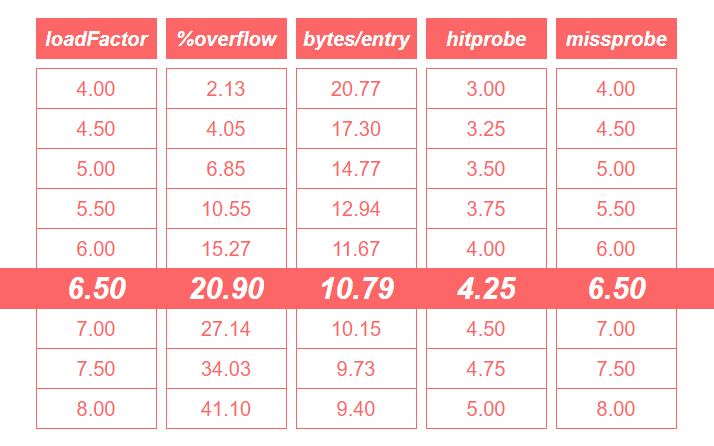
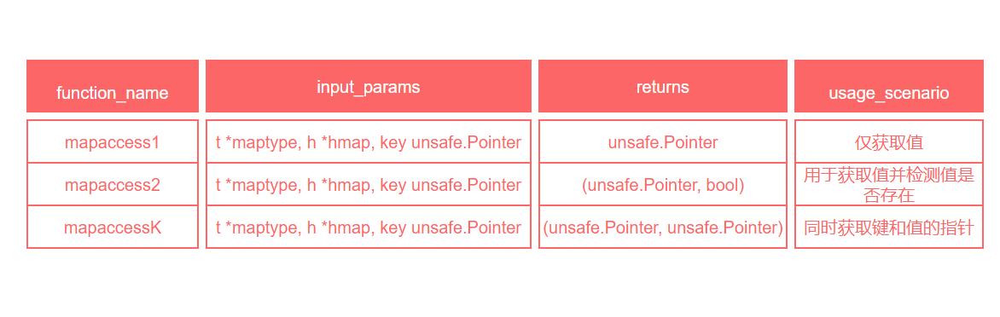
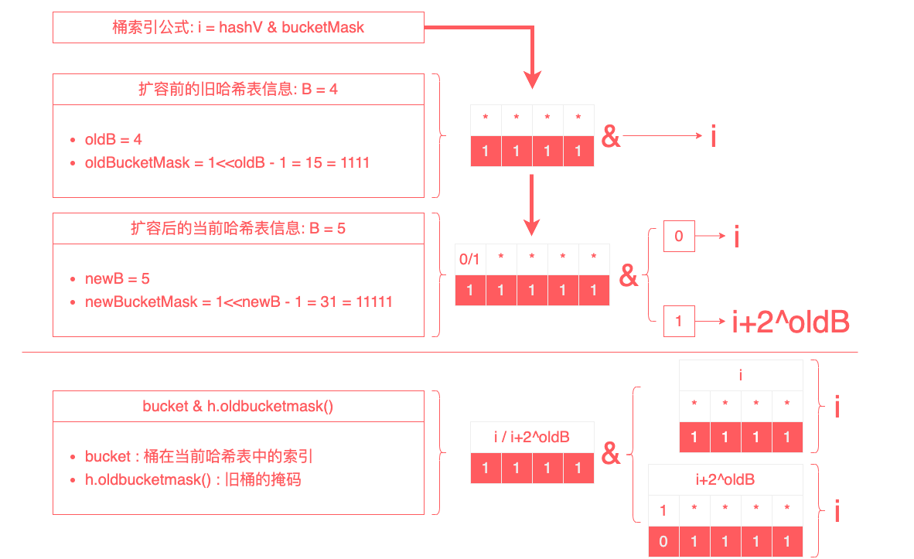

# Go Map 源码解析

在我们开始对 map 的源码进行解析前，我想先梳理一些有关 map 的额外信息，希望的是能有助于阅者们少走弯路。
* 1、基于 map 的 Go 源码版本路径差异：
* * 1.1、Go1.10 及 以下版本的 map 源码路径：src/runtime/hashmap.go
* * 1.2、Go1.11 及 以上版本（目前截止到 Go1.23）的 map 源码路径：src/runtime/map.go
* 2、map 的 make 初始化创建的底层源码实现，是有两套方案：
* * 2.1、小容量 map 的初始化：func makemap_small() *hmap
* * 2.2、大容量 map 的初始化：func makemap(t *maptype, hint int, h *hmap) *hmap

***Now that the digression is over, let’s get back to the point.***

## 1、map 的数据结构
说起 map 这个概念，那就不得不提起国内版本中永远的“八股文之王”了，java 的 HashMap(jdK8)。虽说 java 因为 Oracle 的付费操作，而让国内的玩家们长期停滞于 JDK8 的版本。但我们也不得不承认，HashMap 的底层设计堪称一代经典之作。如果你已经有了对 HashMap 的了解，那么关于 Go map 的设计理念将会更容易去理解。没有也无妨，我们简单描述一下 HashMap 的数据结构，也算为 Go map 做个铺垫。

HashMap(jdk8) 图解


* HashMap，它是以 key-value 的方式进行数据存储，在底层的构成上，是基于 数组+链表 的方式来实现；
* 存储上，根据 key 进行一个哈希运算，从而得到一个关于 key 的 hash值。通过这个 hash值 来定位 key-value 在数组上的存储位置。理想情况下，自然是一个 hash值 只占一个位置。但现实往往是不遂人愿的，哈希运算的结果不可避免的在大数据压力下会造成重复的 hash值，这样的结果就是，虽然 key 不一致，但运算后的 hash值 却是一样的，这样就会造成过失性的数据覆盖，也就是我们常说的 哈希冲突；
* 所以为了容错这一不可避免的 哈希冲突，在 map 中，key 的 hash值 相同时，会在对应的位置，延伸出一个 链表，用于存储 相同 hash值 的不同 key-value；
* other：从 java8 开始，当链表长度超过一定阈值( 链表长度大于 8 )时，会转换为 红黑树，用以提高性能。
---
在简单梳理了一下 HashMap 的设计想法后，我们可以简单地总结一下有关 map 的组成模块
* 1、存储数据的方式：key-value
* 2、用于定位底层存储位置的标识，哈希值，将 key 进行哈希运算而得到；
* 3、底层的数据结构组成：
* * 3.1、在没有 hash 冲突的理想情况下，就是一个 数组，也可以说是一个 哈希表；
* * 3.2、在存在 hash 冲突的现实情况下，数组 + 链表(或任意存储模块，只要能存放值，理论上都可以)；
---
基于上述简单总结，我们终于是可以打开源码的文件了，/src/runtime/map.go (当前 Go1.20 版本)

而在打开源码后，我们要做的第一步，并不是马不停蹄地开始阅读源码，如果你是第一次打开源码，相信我，你根本不知道从哪里开始起头阅读。而这个时候，我的建议是，从开头第一行开始，不用管它是什么，因为源码开发者就是如此地纯粹，任何源码中的存在都是具有价值的。哪怕你英文阅读不好，也不要怕，open 百度，open Google。

只要你细细阅读 map.go 的注释，你就会发现，其实关于 Go map 的设计想法，Google的大佬们早在一开始就说明了，只是 use English，而我们只需要将其翻译成中文即可。

以下为 map.go 第7行 --- 第31行的简略译文：
* map 只是一个 哈希表。数据被安排存储到一个 buckets(桶) 数组。每个 bucket 包含 8对 key/value。哈希的低位被用于选择一个 bucket，每个 bucket 都包含着 每个 哈希的几个高位，高位的意义是用于区分单个 bucket 内部的条目。
* 如果一个 bucket 中的条目超过了 8对 key/value， 我们会链接一个额外的 bucket。
* 当 哈希表扩容 时，我们会分配一个 两倍大的 新的 bucket 数组。而后将数据逐渐从 旧的bucket数组 复制到 新的bucket数组。
* Map 迭代器遍历 buckets 数组并按遍历顺序返回 key（先在 桶编号，然后是 溢出链顺序，最后是 桶内索引）。为了保持迭代语义，我们从不移动存储在桶内 keys 的位置（如果我们移动了，那么 keys 可能会返回 0 或 2 次）。当我们扩容表时，迭代器仍在旧表上进行迭代，如果他们正在遍历的桶已经被移动("evacuated")到新的哈希表中，则必须检测新的哈希表。
---
从上面的简略译文，我们也就了解到 Go map 的一个大致模型了：
* Go map 本质上是一个由 bucket 组成的 哈希表；
* 每个 bucket 最多包含 8 对 key/value;
* key 的 哈希值，分为 高位 和 低位，低位用于索引 bucket 的位置，高位用于区分 bucket内部的条目位置；
* bucket 内部超过 8对 key/value 后，额外链接一个 bucket；


是不是发现 Go map 和 HashMap 有那么一点儿相似的味道了。

而在做了这么多铺垫后，我们终于可以开始美妙的源码阅读时间了。

先让我们整合一下 map.go 中的结构体
* 1、hmap：Go map 的头部数据结构，包含了 map 的元数据 和 状态信息
* 2、bmap：Go map 的 bucket 数据结构，由四个部分组成，tophash 为 bmap 的结构体部分，其他三个组成部分为编译器在底层为其内存布局而预留的空间
* * 2.1、tophash [bucketCnt]uint8 : 存储每个 key 的哈希值的高字节(top byte)；
* * 2.2、然后续接 最多 bucketCnt 个 keys；
* * 2.3、然后续接 最多 bucketCnt 个 elems；
* * 2.4、最后额外接一个 overflow(溢出桶)指针；
* 3、mapextra：Go map 的额外信息

```go
// Go map 的头部
type hmap struct {
	// 笔记: hmap 的格式在 cmd/compile/internal/reflectdata/reflect.go. 中被编码
	// 请确保与编译器的定义保持一致
	count     int // # 活跃值 == map的容量.  必须在第一个 (被 len() 内建函数使用)
	flags     uint8 // 标记字段，用于存储与 map 状态相关的标记位
    
    /* 
        B 表示 桶数量的以2为底的对数。
        也就是说，桶数量是 2 的 `B` 次方。

        `loadFactor` 为预定义的常量或变量，用于调整哈希表的 负载因子
    */
	B         uint8  // log以2为底，桶数量的对数 (可以存储 loadFactor * 2^B 个元素)
	noverflow uint16 // 溢出桶的大致数量
	hash0     uint32 // 哈希种子

	buckets    unsafe.Pointer // 桶数量的指针，规模为 2^B 。如果 count==0，则可能为 nil
	oldbuckets unsafe.Pointer // 旧的桶数组指针，其大小为当前数组的一半，仅在扩展过程中非空。（ 在哈希表扩展(rehash)过程中，指向旧的桶数组。当新的桶数组正在填充时，这个字段保存旧的桶数组 ）
	nevacuate  uintptr        // 搬迁进度计数器（小于此数值的桶已经搬迁了）在扩展过程中，指示已经完成搬迁的桶的数量

	extra *mapextra // 额外字段（包含一些非必要但有用的信息，如 溢出桶的列表）
}
```

```go
// Go map 中的 bucket
type bmap struct {
    /* 
    译文：
        tophash 通常情况下，存储了 bucket 中每个 key 的哈希值的 高字节(top byte)。
        如果 tophash[0] < minTopHash，则 tophash[0] 表示这个桶正处于迁移(evacuation)状态
    */
	tophash [bucketCnt]uint8
    /* 
    译文：
        再接着，bucketCnt 个 keys，然后是 bucketCnt 个 elems。
        笔记：将所有 keys 打包放一起，然后把所有 elems 放一起。这样做的话，虽然使得代码比起交替 key/elem/key/elem/... 更为复杂。
            但它能消除因内存对齐需求而产生的填充空间，从而更高效地利用内存。例如：map[int64]int8。
        再接着是一个 overflow(溢出桶) 指针。
    */
}
```
```go
// Go map 的额外数据，并不是所有的 map 都需要的
type mapextra struct {
	/* 
    译文：
        1、当键和值不包含指针时，可以标记桶类型为不包含指针，从而避免垃圾回收器扫描这些桶
        2、尽管如此，桶本身的 overflow 字段是一个指针，为了保持这些溢出桶的存活，需要将它们的指针存储在 hmap.extra.overflow 和 hmap.extra.oldoverflow 中。
        3、overflow 和 oldoverflow 字段分别用于 当前哈希表的溢出桶 和 旧哈希表的溢出桶
        4、通过这种方式，可以在迭代器中灵活地管理和引用这些溢出桶
    */
	overflow    *[]*bmap // 指向当前哈希表的溢出桶的切片
	oldoverflow *[]*bmap // 指向旧哈希表的溢出桶的切片。这在哈希表扩容时使用，以保持对老桶的引用，直到所有的旧数据被搬移到新的桶中

	// nextOverflow holds a pointer to a free overflow bucket.
	nextOverflow *bmap // 指向一个空闲的溢出桶，用于快速分配新的溢出桶
}
```
在对源码中的 struct 进行解析后，我们可以将上面的粗略 Go map 图解进行细分。
* 1、hmap 作为 Go map 的头部信息，也是它的表侧结构体。其中字段 buckets 是 指向底层的哈希表的指针引用；
* 2、底层的 哈希表 是一个 bucket 数组，容量规模为 2^B;
* 3、bucket 的桶结构体是由 bmap 组成，bmap 的结构体虽然只有 tophash 一个字段，但编译器会将 keys、elems、overflow的指针在内存中逐次接续起来，从而形成一个 bucket 的整体内存布局；
* 4、bmap 中 keys 和 elems 的排列方式是：key1/key2.../key8 + elem1/elem2/.../elem8;
* 5、hmap.extra.overflow 指向 当前哈希表的溢出桶的切片


在解析完 Go map 的底层数据结构后，我们应该需要注意到几个优秀的特异点

***第一个特异点：存储方式上的差异***

那就是在 bucket 中 keys、elems 的存储布局

不是我们想象中的 交替 key/elem/key/elem/... 

***而是 key1/key2.../key8 + elem1/elem2/.../elem8***  

注释文中也有提及，这样的存储方式有利于消除 字节对齐 的影响，从而提高内存效用。同时Google 的大佬们也十分贴心地给出了一个例子：map[int64]int8，我们就以此来验证一下上述两种存储布局方式的内存大小吧

关于内存中的字节对齐的详解，可以阅读 [字节对齐](alignment.md) 进行了解

这里简单讲一下内存中的字节对齐，我们就以 map[int64]int8 的两种存储方式为例。

字节对齐：为了内存布局 和 数据读取的需要，指对不同类型的组合，在同一存储空间内要保证内存占用的一致性，而对齐的标准则是以 类型中字节占比最大者决定的，而字节占比不足者，则需要通过填充字节来进行补齐（本质上就是 空间换时间）。

* 1、交替 key/elem/key/elem/... 这样的方式，我们可以抽象为类似一个结构体
```go
type mapS struct {
	k int64
	v int8
}
```
* 2、key1/key2.../key8 + elem1/elem2/.../elem8 则可以理解为，分别使用 []int64 来存储 keys，使用 []int8 来存储 elems
```go
var keys []int64
var elems []int8
```

```go
type mapS struct {
	k int64
	v int8
}
func main() {
	a := mapS{}
	// 计算 map 的内存占用
	mapSize := unsafe.Sizeof(a)
	fmt.Println("mapSize : ", mapSize)

	fmt.Println("k-size: ", unsafe.Sizeof(a.k))
	fmt.Println("v-size: ", unsafe.Sizeof(a.v))
}
/* 
mapSize :  16
k-size:  8
v-size:  1
*/
```

---

***第二个特异点：bmap 的内存布局***
```go
// A bucket for a Go map.
type bmap struct {
	tophash [bucketCnt]uint8
}
```
单从源码中来看，bucket 的 结构体 bmap 不就是只有一个 tophash 字段嘛。为什么注释描述中却提及了，keys、elems、overflow 的存储了。说是编译器的底层实现，我们如何来证实呢？
```go

const bucketCntBits = 3
const bucketCnt = 1 << bucketCntBits

// A header for a Go map.
type hmap struct {
	count      int // # live cells == size of map.  Must be first (used by len() builtin)
	flags      uint8
	B          uint8          // log_2 of # of buckets (can hold up to loadFactor * 2^B items)
	noverflow  uint16         // approximate number of overflow buckets; see incrnoverflow for details
	hash0      uint32         // hash seed
	buckets    unsafe.Pointer // array of 2^B Buckets. may be nil if count==0.
	oldbuckets unsafe.Pointer // previous bucket array of half the size, non-nil only when growing
	nevacuate  uintptr        // progress counter for evacuation (buckets less than this have been evacuated)
	extra      *mapextra      // optional fields
}

// mapextra holds fields that are not present on all maps.
type mapextra struct {
	overflow     *[]*bmap
	oldoverflow  *[]*bmap
	nextOverflow *bmap
}

// A bucket for a Go map.
type bmap struct {
	tophash [bucketCnt]uint8
}

func main() {
	// 构建一个 Go map (刚好一个 满 bucketCnt 的 bucket)
	a := make(map[int]int, bucketCnt)
	for i := 0; i < bucketCnt; i++ {
		a[i] = i * 10
	}
	// 利用反射来获取 Go map 的头部信息 hmap
	val := reflect.ValueOf(a)
	hdr := (*hmap)(unsafe.Pointer(val.Pointer()))
	fmt.Printf("Map metadata: count=%d, flags=%d, B=%d, noverflow=%d, hash0=%d\n",
		hdr.count, hdr.flags, hdr.B, hdr.noverflow, hdr.hash0)
	fmt.Println("----------------------------------------------------------------------------------------------")
	// 遍历 bucket 并打印内容
	bucketSize := uintptr(unsafe.Sizeof(bmap{}))
	for i := 0; i < 1<<int(hdr.B); i++ {
		// hmap.buckets 为 底层buckets数组的指针。叠加 第i个 bucket结构体的size，从而获取第i个 bucket 的起始地址
		bucketAddr := uintptr(hdr.buckets) + bucketSize*uintptr(i)
		// 获取 bmap
		bucket := (*bmap)(unsafe.Pointer(bucketAddr))
		fmt.Printf("Bucket %d: tophash=%v\n", i, bucket.tophash)
		// keys 的起始地址 = bucket的起始地址 + tophash的size
		keysStart := bucketAddr + unsafe.Sizeof(bucket.tophash)
		// elems 的起始地址 = keys的起始地址 + keys的size
		elemsStart := keysStart + bucketCnt*unsafe.Sizeof(int(0))
		fmt.Println("keys: ")
		for j := 0; j < bucketCnt; j++ {
			key := *(*int)(unsafe.Pointer(keysStart + uintptr(j)*unsafe.Sizeof(0)))
			fmt.Printf("	key[%d]: %d\n", j, key)
		}

		fmt.Println("elems: ")
		for j := 0; j < bucketCnt; j++ {
			elem := *(*int)(unsafe.Pointer(elemsStart + uintptr(j)*unsafe.Sizeof(0)))
			fmt.Printf("	elem[%d]: %d\n", j, elem)
		}
		// 溢出桶的指针地址 = elems 的起始地址 + elems的size
		overflowPtr := elemsStart + bucketCnt*unsafe.Sizeof(int(0))
		overflow := *(*uintptr)(unsafe.Pointer(overflowPtr))
		fmt.Printf("overflow pointer: %p\n", unsafe.Pointer(overflow))
	}
}
/* 
Map metadata: count=8, flags=0, B=0, noverflow=0, hash0=3136877097
----------------------------------------------------------------------------------------------
Bucket 0: tophash=[95 24 47 137 25 208 213 100]
keys: 
	key[0]: 0
	key[1]: 1
	key[2]: 2
	key[3]: 3
	key[4]: 4
	key[5]: 5
	key[6]: 6
	key[7]: 7
elems: 
	elem[0]: 0
	elem[1]: 10
	elem[2]: 20
	elem[3]: 30
	elem[4]: 40
	elem[5]: 50
	elem[6]: 60
	elem[7]: 70
overflow pointer: 0x0
*/
```

## 2、map 的常量配置
```go
const (
	// 表示每个桶（bucket）能容纳的键值对的数量的位数
	bucketCntBits = 3
	bucketCnt     = 1 << bucketCntBits // 每个桶的最大容量 1 << 3 ---> 8

	/* 
    loadFactorNum 和 loadFactorDen：这两个常量定义了触发哈希表增长的负载因子。负载因子是桶的平均负载量的最大值，当超过这个值时哈希表会进行扩展。

    这里的负载因子被定义为 13/2 = 6.5。即当平均每个桶超过6.5个键值对时，哈希表会触发扩展。
    */
	loadFactorNum = 13
	loadFactorDen = 2

	/* 
    maxKeySize 和 maxElemSize：定义了键和元素的最大大小。
    如果键或元素的大小超过这个值，将会被分配到堆上而不是内联存储。单位是字节。
    */
	maxKeySize  = 128
	maxElemSize = 128

	/* 
    dataOffset：定义了哈希桶结构体 bmap 的数据部分的偏移量。为了保证对齐，特别是在某些架构上（例如 amd64p32），这个偏移量需要是64位对齐的。
    */
	dataOffset = unsafe.Offsetof(struct {
		b bmap
		v int64
	}{}.v)

	// tophash 相关的常量，用于标识单元格的状态
	emptyRest      = 0 // 这个单元为空，且之后的单元（包括溢出桶）也是空的。
	emptyOne       = 1 // 这个单元为空
	evacuatedX     = 2 // key/elem 有效，已经被迁移到较大表的前半部分。
	evacuatedY     = 3 // key/elem 有效，已经被迁移到较大表的后半部分。
	evacuatedEmpty = 4 // 单元为空，桶已经被迁移。
	minTopHash     = 5 //  普通已填充单元的最小 tophash 值。

	// 常量是标志位，用于标识哈希表操作的不同状态
	iterator     = 1 // 可能有迭代器正在使用桶
	oldIterator  = 2 // 可能有迭代器正在使用旧桶
	hashWriting  = 4 // 表示有一个 goroutine 正在写入哈希表
	sameSizeGrow = 8 // 表示当前哈希表的扩展是扩展到与原来大小相同的新哈希表。

	// 定义了一个哨兵值，用于迭代器检查。这个值表示在特定条件下不进行检查。它是通过对指针大小进行位移操作计算出来的，确保了适用于不同架构。
	noCheck = 1<<(8*goarch.PtrSize) - 1
)
```
在常量配置中，我们应该需要着重关注两个值
* 1、负载因子 : 6.5
```go
// 负载因子 : 6.5 = loadFactorNum/loadFactorDen
const (
    loadFactorNum = 13
	loadFactorDen = 2
)
```
负载因子的作用：负载因子是桶的平均负载量的最大值，当超过这个值时哈希表会进行扩展。那么为什么会选择 6.5 作为这个阈值呢？其实这个在源码中也是早早就说明了因由的（mao.go 第33行 - 第54行）

总结一下就是，***负载因子是哈希表中元素数量与桶（bucket）数量的比值。过高的负载因子会导致大量的溢出桶（overflow buckets），而过低的负载因子会浪费大量空间。***

然后基于数值量化的测试结果，选择了一个最佳项

* %overflow: 使用溢出桶的百分比。意思是，当设定了一个溢出阈值后，有多少百分比的桶会在此阈值限制下触发溢出；
* bytes/entry: 每个键/元素对的开销字节数。负载因子增加时，虽然溢出桶增加，但每个条目的字节开销减少。
* hitprobe: 查找存在键时需要检查的条目数。命中探测次数随着负载因子的增加而增加，因为更多的元素会导致更多的碰撞。
* missprobe: 查找不存在键时需要检查的条目数。未命中探测次数随着负载因子的增加而增加，因为更多的元素会导致更多的碰撞。

总结：  
负载因子的选择需要在溢出桶的数量、空间开销和查找性能之间进行权衡。注释中的数据表明：
* 较低的负载因子（如4.0）会导致较少的溢出桶和较高的每个条目的字节开销，但查找性能更好（较少的探测次数）。
* 较高的负载因子（如8.0）会导致较多的溢出桶和较低的每个条目的字节开销，但查找性能较差（更多的探测次数）。

---
* 2、哈希桶结构体 bmap 的数据部分的偏移量  
bmap 的结构体是哈希桶的内部表示。主要由四个部分组成：
* * 2.1、元数据（tophash）
* * 2.2、键数组
* * 2.3、值数组
* * 2.4、overflow ：溢出桶指针(当键值对数量大于8后，额外添加一个溢出桶)
```go
/* 
unsafe.Offsetof 是一个 Go 语言中的内置函数，用于计算结构体字段相对于结构体起始地址的偏移量。
这里用于返回结构体字段相对于结构体起始地址的偏移量 v int64 = 8 bytes 正好等于 [8]uint8

dataOffset 确定了数据部分的起始位置，便于哈希表实现中访问桶中的键值对。
*/
const (
	dataOffset = unsafe.Offsetof(struct {
		b bmap
		v int64
	}{}.v)
)
```
---
## 3、map 的初始化
* map 的 make 初始化创建的底层源码实现，是有两套方案：
* * 1、小容量 map 的初始化：func makemap_small() *hmap
* * 2、大容量 map 的初始化：func makemap(t *maptype, hint int, h *hmap) *hmap


***小容量 map 的初始化***
```go
// makemap_small implements Go map creation for make(map[k]v) and
// make(map[k]v, hint) when hint is known to be at most bucketCnt
// at compile time and the map needs to be allocated on the heap.
/* 
译文：
	makemap_small 用于实现 Go map 的创建，通过 make(map[k]v) 和 make(map[k]v, hint) 。
	前提是，在编译时期 就已知 hint 最多为 bucketCnt。并且 map 需要被分配到 heap 上
*/
func makemap_small() *hmap {
	h := new(hmap)
	// fastrand() 是一个快速生成随机数的函数，用于初始化 map 的哈希种子（hash0）。
	h.hash0 = fastrand()
	return h
}
```
所以由注释可知，当 运行 make(map[k]v) 和 make(map[k]v, hint)，hint < bucketCnt(8) 时，底层调用的是 makemap_small()

这样做的好处是：
* 1、快速分配：直接调用 new(hmap) 在堆上分配内存，实现快速分配，简洁高效；
* 2、减少内存碎片：通过在堆上分配小型 map，可以有效减少内存碎片。这对于需要频繁创建和销毁小型 map 的场景非常有用。
---
***大容量 map 的初始化(通用型创建流程)***
```go

// makemap implements Go map creation for make(map[k]v, hint).
// If the compiler has determined that the map or the first bucket
// can be created on the stack, h and/or bucket may be non-nil.
// If h != nil, the map can be created directly in h.
// If h.buckets != nil, bucket pointed to can be used as the first bucket.
/* 
译文：
	1、makemap 实现了 Go map 中通过 make(map[k]v, hint) 创建 map 的功能
	2、如果编译器已确定 map 或 第一个 bucket 可以在栈上创建，那么 h and/or bucket 可能 非空。
	3、如果 h != nil，map 可以直接在 h 中 创建。
	4、如果 h.bucket != nil，那么可以使用 h.bucket 所指向的桶 来 作为第一个桶。
*/
/* 
params:
	t *maptype: 映射类型信息
	hint int: 提示的初始大小
	h *hmap: 可能是预先分配的map指针（如果不为 nil，可以直接在其中创建 map）
*/
func makemap(t *maptype, hint int, h *hmap) *hmap {
	// 计算内存需要 并 检测是否溢出
	mem, overflow := math.MulUintptr(uintptr(hint), t.bucket.size)
	// 溢出了 或 申请内存 大于 最大内存空间
	// 将 hint 赋值为 0，保证 map 创建完成 且 不会溢出
	if overflow || mem > maxAlloc {
		hint = 0
	}

	// initialize Hmap
	if h == nil {
		h = new(hmap)
	}
	h.hash0 = fastrand()

	// Find the size parameter B which will hold the requested # of elements.
	// For hint < 0 overLoadFactor returns false since hint < bucketCnt.
	/* 
		循环调用 overLoadFactor(hint, B)，直到 B 能够容纳 hint 个元素 
		overLoadFactor(hint, B) ：用于判断当前的 B 是否满足负载因子的要求
	*/
	B := uint8(0)
	for overLoadFactor(hint, B) {
		B++
	}
	h.B = B

	// allocate initial hash table
	// if B == 0, the buckets field is allocated lazily later (in mapassign)
	// If hint is large zeroing this memory could take a while.
	/* 
		if B == 0，则延迟分配桶数组，稍后在插入操作(mapassign)中再分配
		if hint 很大，那么清零这个内存可能需要一段时间
	*/
	if h.B != 0 {
		var nextOverflow *bmap
		// 调用 makeBucketArray(t, h.B, nil) 创建桶数组，并返回第一个空闲的溢出桶指针 nextOverflow
		h.buckets, nextOverflow = makeBucketArray(t, h.B, nil)
		// if nexeOverflow 不为空，则分配一个 mapextra，并赋值对应字段
		if nextOverflow != nil {
			h.extra = new(mapextra)
			h.extra.nextOverflow = nextOverflow
		}
	}

	return h
}
```
基于源码，我们可以对 Go map 通用的初始化创建流程进行一个总结：
* 1、计算所有内存并判定是否溢出；
* 2、初始化 hmap 并 赋值其 哈希种子；
* 3、计算哈希表的大小参数 B；
* 4、根据 B 初始化 哈希桶数组 并 处理溢出桶的管理器

对于 makemap 函数中的代码逻辑，前面的 1、2、3 点 都是对于数值的计算，目的只是为了给第4点，桶数组的构建服务的。毕竟 Go map 的本质就是一个
哈希表而已，所以我们还需进一步探查 Go map 的核心逻辑，makeBucketArray 函数
```go

// makeBucketArray initializes a backing array for map buckets.
// 1<<b is the minimum number of buckets to allocate.
// dirtyalloc should either be nil or a bucket array previously
// allocated by makeBucketArray with the same t and b parameters.
// If dirtyalloc is nil a new backing array will be alloced and
// otherwise dirtyalloc will be cleared and reused as backing array.
/* 
译文：
	1、makeBucketArray 为 map 的 buckets 初始化一个底层数组。
	2、1<<b 是分配的最小桶数量。
	3、dirtyalloc 要么为 nil，要么是一个 由 makeBucketArray函数 基于相同 t 和 b 参数而分配的 桶数组。
	4、如果 dirtyalloc 为 nil，则会重新分配一个底层数组，否则，就将 dirtyalloc 清空并重新作为底层数组使用。
*/
/* 
params:
	t *maptype : map 的类型信息
	b uint8 : 桶数量的对数
	dirtyalloc unsafe.Pointer : 一个指向先前桶数组的指针（可能为 nil）
*/
func makeBucketArray(t *maptype, b uint8, dirtyalloc unsafe.Pointer) (buckets unsafe.Pointer, nextOverflow *bmap) {
	// bucketShift(b) 通常返回 1 << b，表示需要的最小桶数量
	base := bucketShift(b)
	nbuckets := base
	// For small b, overflow buckets are unlikely.
	// Avoid the overhead of the calculation.
	/* 
		对于较小的 b，溢出桶不太可能（出现）。（直接过滤）避免计算开销
		这里选择 b >= 4 作为判定条件的原因：我认为是和上面的 makemap_small 形成呼应，因为Google的大佬们将 小于等于 bucketCnt(8 == 1 << 3)的容量，归结于小容量判定中了，而在 makemap_small 中是直接 new(hmap) 就快速结束了，那么证明，在其底层的数值验算中，b <= 3 的容量，是几乎不可能出现溢出桶的。

		故而，在通用型的 哈希表 创建流程中，将溢出桶的判定限制在了 b >= 4.
	*/
	if b >= 4 {
		// Add on the estimated number of overflow buckets
		// required to insert the median number of elements
		// used with this value of b.

		// bucketShift(b - 4) ：计算所需的溢出桶数量，并叠加到初始桶数量上
		nbuckets += bucketShift(b - 4)
		// 重新计算 总size ，并将其向上取整(roundupsize(sz))
		sz := t.bucket.size * nbuckets
		up := roundupsize(sz)
		// 数值不统一时，则根据向上取整后的数值，重新计算 初始桶的数量
		if up != sz {
			nbuckets = up / t.bucket.size
		}
	}

	/* 
	dirtyalloc 为 nil，则重新 new 一个底层数组
	dirtyalloc 不为 nil，则将其清空（根据是否包含指针进行判定） 并 重新作为底层数组
	*/
	if dirtyalloc == nil {
		buckets = newarray(t.bucket, int(nbuckets))
	} else {
		// dirtyalloc was previously generated by
		// the above newarray(t.bucket, int(nbuckets))
		// but may not be empty.
		buckets = dirtyalloc
		size := t.bucket.size * nbuckets
		if t.bucket.ptrdata != 0 {
			// memclrHasPointers : 用于清除包含指针的桶数组 
			memclrHasPointers(buckets, size)
		} else {
			// memclrNoHeapPointers : 用于清除不包含指针的桶数组
			memclrNoHeapPointers(buckets, size)
		}
	}
	// 如果 base != nbuckets，表示预分配了一些溢出桶
	if base != nbuckets {
		// We preallocated some overflow buckets.
		// To keep the overhead of tracking these overflow buckets to a minimum,
		// we use the convention that if a preallocated overflow bucket's overflow
		// pointer is nil, then there are more available by bumping the pointer.
		// We need a safe non-nil pointer for the last overflow bucket; just use buckets.
		/* 
		译文：
			1、我们预分配了一些溢出桶；
			2、为了将跟踪这些溢出桶的开销保持在最低限度；
			3、我们使用了一个约定，如果预分配的 溢出桶 的 overflow指针 是 nil，则可以通过指针递增来获取更多可用的溢出桶；
			4、对于最后一个溢出桶，我们需要一个安全的 非nil 指针，可以直接使用 buckets
		*/
		/* 
			add(buckets, base*uintptr(t.bucketsize)) : 将 buckets(桶数组的起始指针) 指针加上一个 base*uintptr(t.bucketsize) 的偏移量
			这样就可以计算得出 下一次 可使用的 预分配溢出桶的地址。			
		*/
		nextOverflow = (*bmap)(add(buckets, base*uintptr(t.bucketsize)))
		// 计算出预分配桶数组的最后一个桶的地址：buckets(桶数组的起始指针) + (分配的总桶数 - 1)*桶size
		last := (*bmap)(add(buckets, (nbuckets-1)*uintptr(t.bucketsize)))
		// 将最后一个桶的 overflow 赋上一个有效值，确保遍历时正确终止
		last.setoverflow(t, (*bmap)(buckets))
	}
	return buckets, nextOverflow
}
```
关于上述的 哈希表 初始化源码，其中关于 溢出桶的预分配机制，有两个比较复杂的点，我想费些口舌来整理一下。

***0 - Go map 的运行时映射信息 MapType***
```go
type maptype struct {
	typ    _type // 继承 基类type
	key    *_type // 键的类型
	elem   *_type // 值的类型
	bucket *_type // 哈希桶的类型
	// function for hashing keys (ptr to key, seed) -> hash
	hasher     func(unsafe.Pointer, uintptr) uintptr // 哈希函数，用于计算 key 的哈希值
	keysize    uint8  // 键槽的大小
	elemsize   uint8  // 值槽的大小
	bucketsize uint16 // 表示 每个桶的大小，单位为字节
	flags      uint32 // 标记位，用于存储一些额外判定信息
}
```

***1 - if a preallocated overflow bucket's overflow pointer is nil, then there are more available by bumping the pointer.***  
译文：如果预分配的 溢出桶 的 overflow指针 是 nil，则可以通过指针递增来获取更多可用的溢出桶

我们梳理一下重点：

* 1、预分配的溢出桶的作用：我们知晓当 一个 bucket 装满后，数据就会溢出，这时数据就需要存入一个溢出桶中，而预分配的作用就是减少频繁的内存分配；
* 2、预分配的 溢出桶 overflow 为 nil 的意义，这里首先需要区分两种不同环境下的 溢出桶overflow为nil：
* * 2.1、常态情况下，常规 Go map 运行时，此时 Go map 中有一个 bucketA，当数据插入这个 bucketA 直到溢出时，如果此时 bucketA 的 overflow 仍为 nil，那么说明此时 Go map 中已经没有额外的预留空间用于数据分配了，只能向内存中重新申请了。
* * 2.2、在初始化 Go map 时的预留溢出桶机制下，此时的 溢出桶 属于预分配的，还未被使用，那么它的 overlflow 字段自然是nil 的
* 3、bumping the pointer(指针递增)的概念:  意味通过增加指针地址的方式来查找下一个内存位置。（这里是基于桶数组内存分配的连续性而得到的性质。由上文得知，桶数组是基于一个数量值( 本桶数 + 预分配的溢出桶数 )进行底层统一分配的。）

***2 - We need a safe non-nil pointer for the last overflow bucket; just use buckets.***  
译文：对于最后一个溢出桶，我们需要一个安全的 非nil 指针，可以直接使用 buckets

也是一样的，check 以下文字重点：

* 1、为什么最后一个溢出桶需要一个 安全的 非 nil 指针？
* * 上一段已经描述了，在 预分配时期，溢出桶的overfl 为 nil ，那么就代表后续还有更多的溢出桶了。所以为了确保系统在处理溢出桶时正常终止，最后一个溢出桶不能为 nil。
* 2、为什么可以直接使用 buckets？
* * 这里是一个取巧的方式，只要保证 指针指向的是一个 有效的 非 nil 值即可。

就此，我们结束了关于 Go map 的初始化创建流程和源码分析。而在我们阅读 makemap 源码时，在进入 makeBucketArray 前的注释中，我们注意到了一点，如果 B == 0，则会延迟分配桶数组，并在插入操作(mapassign)中再分配。

如此，我们关于 Go map 的下一关挑战开始了，插入操作(mapassign)

## 4、map 的数据查询
上面说了，我们想要挑战 插入操作(mapassign)，但不巧的事时有发生，我们发现直接挑战 插入操作(mapassign) 这个Boss，似乎有一点难度，我们当前等级还不够。于是，我们退而求其次，选择了先去刷刷小怪 ---> 查询操作(mapaccess)。

为什么说 插入操作(mapassign) 是个 Boss 呢，因为它有很多不同的招数啊：
* 1、根据提供的 key 去 map 中查询其 是否已存在；
* 2、如果 key 存在，则更新 key 的 value 
* 3、如果 key 不存在，则分配一个新的槽位来插入这对新的 key-value；
* * 3.1、还有隐藏大招-1：如果插入新的key-value溢出时，还要考虑溢出桶的问题；
* * 3.2、还有隐藏大招-2：如果插入新的key-value空间不足时，还要考虑扩容的问题；

这样看下来，是不是感觉这个 Boss 有点难打了。不利于一次性吸收，所以我们再看看 查询操作(mapaccess) 

而 查询操作(mapaccess) ，我们只需要做第一步，根据提供的 key 去 map 中查询其 是否存在 即可。是不是感觉要 easy 得多了。😜

但在我们想要阅读有关 查询操作(mapaccess) 的源码时，却是再次出现了问题（这小怪居然会一气化三清，wdnmd(我带你们打)！！！）。

在 Go1.20 的版本中，有关 查询操作(mapaccess)的操作，Google 的大佬们再次玩了些花活儿，将 mapaccess 细分为了三个分支；
```go
// (1)
// mapaccess1 returns a pointer to h[key].  Never returns nil, instead
// it will return a reference to the zero object for the elem type if
// the key is not in the map.
// NOTE: The returned pointer may keep the whole map live, so don't
// hold onto it for very long.
/* 
译文：
	mapaccess1 返回一个指向 h[key] 的指针。如果键不在map中，它不会返回nil，而是返回元素类型的零值对象的引用。
	笔记：返回的指针可能会导致整个map被保持在内存中，因此不要长时间持有这个指针。
*/
func mapaccess1(t *maptype, h *hmap, key unsafe.Pointer) unsafe.Pointer
// ---------------------------------------------------------------------------------------------

// (2)
// 从哈希表中获取指定键对应的值，同时返回一个 bool 值表示键是否存在（功能主体 与 mapaccess1 基本一致）
func mapaccess2(t *maptype, h *hmap, key unsafe.Pointer) (unsafe.Pointer, bool)
// ---------------------------------------------------------------------------------------------

// (3)
// returns both key and elem. Used by map iterator.
// 从哈希表中获取 指定键 和 对应值
func mapaccessK(t *maptype, h *hmap, key unsafe.Pointer) (unsafe.Pointer, unsafe.Pointer)
```

整理一番后发现，三个方法的实现逻辑大同小异，只是为了适应不同的 return 而独立了相应的逻辑。  
这里仅以 mapaccess1 为例来梳理 查询操作(mapaccess) 逻辑
```go
/* 
params:
	t *maptype: 哈希表的map类型
	h *hmap: Go map 的头部信息
	key unsafe.Pointer: 需要查询的key的指针
*/
func mapaccess1(t *maptype, h *hmap, key unsafe.Pointer) unsafe.Pointer {
	// 并发检测 和 内存安全检测 --------- start ---->
	// racereadpc 和 raceReadObjectPC 用于数据竞争检测。
	if raceenabled && h != nil {
		callerpc := getcallerpc()
		pc := abi.FuncPCABIInternal(mapaccess1)
		racereadpc(unsafe.Pointer(h), callerpc, pc)
		raceReadObjectPC(t.key, key, callerpc, pc)
	}
	// msanread 用于内存清理检测。
	if msanenabled && h != nil {
		msanread(key, t.key.size)
	}
	// asanread 用于地址清理检测。
	if asanenabled && h != nil {
		asanread(key, t.key.size)
	}
	// 并发检测 和 内存安全检测 --------- end ---->

	// 空 map 检查（map 为 nil 或 map 中 元素数量为 0） 
	if h == nil || h.count == 0 {
		if t.hashMightPanic() {
			t.hasher(key, 0) // see issue 23734
		}
		return unsafe.Pointer(&zeroVal[0])
	}
	// 并发写检测
	if h.flags&hashWriting != 0 {
		fatal("concurrent map read and map write")
	}
	// 计算哈希值：使用哈希函数计算 key 的哈希值
	hash := t.hasher(key, uintptr(h.hash0))
	// 计算桶掩码： 通过 bucketMask 计算桶数组的 掩码
	m := bucketMask(h.B)
	// 定位桶：通过 哈希值 和 掩码 计算 桶的索引，并定位到相应的桶
	b := (*bmap)(add(h.buckets, (hash&m)*uintptr(t.bucketsize)))

	// 处理查找时正在扩容中的旧桶
	if c := h.oldbuckets; c != nil {
		if !h.sameSizeGrow() {
			// There used to be half as many buckets; mask down one more power of two.
			m >>= 1
		}
		oldb := (*bmap)(add(c, (hash&m)*uintptr(t.bucketsize)))
		if !evacuated(oldb) {
			b = oldb
		}
	}

	// 查找元素 ---- start ---->
	// 计算 hash值 的 高字节(top byte) ---> 对应桶内的条目索引
	top := tophash(hash)
bucketloop:
// 遍历桶数组：遍历当前桶 及其对应的 溢出桶，查找匹配的键
	for ; b != nil; b = b.overflow(t) {
		for i := uintptr(0); i < bucketCnt; i++ {
			// 如果对应高字节不匹配 且 剩余部分为空，则跳出循环
			if b.tophash[i] != top {
				if b.tophash[i] == emptyRest {
					break bucketloop
				}
				continue
			}
			// 定位到当前桶内的 key
			k := add(unsafe.Pointer(b), dataOffset+i*uintptr(t.keysize))
			// 如果 key 是间接的（指针），则解引用获取 实际key
			if t.indirectkey() {
				k = *((*unsafe.Pointer)(k))
			}
			// 比较 key 的实际值 是否相同
			if t.key.equal(key, k) {
				// 定位到当前桶内的 elem, 如果 elem 是间接的（指针），则解引用获取 实际elem
				e := add(unsafe.Pointer(b), dataOffset+bucketCnt*uintptr(t.keysize)+i*uintptr(t.elemsize))
				if t.indirectelem() {
					e = *((*unsafe.Pointer)(e))
				}
				return e
			}
		}
	}
	// 查找元素 ---- end ---->
	
	//没有找到，则返回 零值对象的指针 
	return unsafe.Pointer(&zeroVal[0])
}
```
在梳理了一番 查询操作(mapaccess) 的源码后，我们可以开始总结重点了
* 1、hasher 哈希运算（在 Go1.20 版本中，关于 key 的哈希运算已经基于不同 type 进行了细化拆分，在底层使用 汇编语言 实现具体逻辑，这样可以进一步提高效率）
* * 1.1、基于 运行时映射 MapType（src/internal/abi/type.go）
```go
type maptype struct {
	// function for hashing keys (ptr to key, seed) -> hash
	hasher     func(unsafe.Pointer, uintptr) uintptr // 哈希函数，用于计算 key 的哈希值(这里是一个函数字段，用于调用底层封装)

}
```
* * 1.2、在我们 debug 进入 makemap 函数时，我们可以得到 MapType 的初始化，从而定位编译器为我们预加载的 Hasher  
例如：
```go
// map[string]int ---> key = string ---> Hasher ---> runtime.strhash
// map[int]int 	  ---> key = int    ---> Hasher ---> runtime.memhash64

/* 
	runtime/alg.go (第46行)，使用 汇编语言 开发，这样可基于不同 cpu 内核来运行，进一步提高效率。
	alg.go 包含了与数据结构（尤其时哈希表）相关的一些算法实现。这些算法的核心部分包括 哈希运算、比较 和 复制对象 等操作。
*/
// in asm_*.s
func memhash(p unsafe.Pointer, h, s uintptr) uintptr
func memhash32(p unsafe.Pointer, h uintptr) uintptr
func memhash64(p unsafe.Pointer, h uintptr) uintptr
func strhash(p unsafe.Pointer, h uintptr) uintptr
/* 
诸如：
	asm_amd64.s   ---> 架构: AMD64(x86-64)
	asm_arm.s     ---> 架构: ARM(32-bit)
	asm_arm64.s   ---> 架构: ARM64(AARch64)
	asm_loong64.s ---> 架构: LoongArch 64
	asm_mips64.s  ---> 架构: MIPS64
	asm_mipsx.s   ---> 架构: MIPS(32-bit)
*/
```
* 2、有关 定位桶 的逻辑解析：通过 哈希值 和 掩码 计算 桶的索引，并定位到相应的桶
```go
	// 计算哈希值：使用哈希函数计算 key 的哈希值
	hash := t.hasher(key, uintptr(h.hash0))
	// 计算桶掩码： 通过 bucketMask 计算桶数组的 掩码
	m := bucketMask(h.B)
	// 定位桶：通过 哈希值 和 掩码 计算 桶的索引，并定位到相应的桶
	b := (*bmap)(add(h.buckets, (hash&m)*uintptr(t.bucketsize)))
```
* * 2.1、m := bucketMask(h.B) : 解析一下 桶数组的 掩码
```go

const PtrSize = 4 << (^uintptr(0) >> 63)
func bucketShift(b uint8) uintptr {
	return uintptr(1) << (b & (PtrSize*8 - 1))
}
func bucketMask(b uint8) uintptr {
	return bucketShift(b) - 1
}
func main() {
	for i := 0; i < 5; i++ {
		v := bucketMask(uint8(i))
		x := bucketShift(uint8(i))
		fmt.Printf("1 << %d = %2d : %5s 1 << %d - 1 = %2d : %s \n", i, x, strconv.FormatUint(uint64(x), 2), i, v, strconv.FormatUint(uint64(v), 2))
	}
}
/* 
1 << 0 =  1 :     1 1 << 0 - 1 =  0 : 0 
1 << 1 =  2 :    10 1 << 1 - 1 =  1 : 1 
1 << 2 =  4 :   100 1 << 2 - 1 =  3 : 11 
1 << 3 =  8 :  1000 1 << 3 - 1 =  7 : 111 
1 << 4 = 16 : 10000 1 << 4 - 1 = 15 : 1111 
*/
```
由上述代码实例，我们可以得知，桶数组的 掩码，其实就是 B 位 全为 1 的二进制数值，这样在进行 按位与 运算时，可以定位有效索引

* * 2.2、b := (*bmap)(add(h.buckets, (hash&m)*uintptr(t.bucketsize))) ：定位桶
* * * 2.2.1、(hash&m) ：通过按位与（同1为1），这样可基于 hash的低位 锁定 正桶 在 哈希表中的 对应桶索引；
* * * 2.2.2、h.buckets : 哈希表中正桶的起始地址；
* * * 2.2.3、(hash&m)*uintptr(t.bucketsize) ：计算 正桶的偏移量；
* * * 2.2.4、(add(h.buckets, (hash&m)*uintptr(t.bucketsize))) : add 函数，将哈希表中正桶的起始地址 叠加上 正桶的偏移量，从而得到 目标桶的地址
* * * 2.2.5、(*bmap)(...) ： 将 目标桶地址 转化为 桶的元结构 - bmap指针
* 3、定位桶后，再根据 哈希值 的 tophash 确定 桶内的条目索引
* * 3.1、计算 hash值 的 高字节(top byte) ---> 对应桶内的条目索引
```go
// tophash calculates the tophash value for hash.
func tophash(hash uintptr) uint8 {
	/* 
		goarch.PtrSize: 表示指针大小(64位 = 8 | 32位 = 4) bytes
		goarch.PtrSize*8：将 字节数 转化 位数(64位 | 32位)
		hash >> (goarch.PtrSize*8 - 8): 将 hash值 右移 (goarch.PtrSize*8 - 8) 位，意味着，保留 hash值 的 最高8位
	*/
	top := uint8(hash >> (goarch.PtrSize*8 - 8))
	// minTopHash：表示 tophash 的有效最小值，如果计算后的 top 比 minTophash 还小，就容错一下。
	// 因为 tophash 小于 minTophash 后 是用于 特殊标记
	if top < minTopHash {
		top += minTopHash
	}
	return top
}
```
* 4、b.overflow(t)：获取溢出桶
```go
func (b *bmap) overflow(t *maptype) *bmap {
	/* 
		uintptr(t.bucketsize)-goarch.PtrSize: 计算 正桶末尾的地址的偏移量，减去一个 goarch.PtrSize(指针大小)，是因为 溢出桶指针 通常存储在结构体中的最后一个字段
		add(unsafe.Pointer(b), offset): 通过 add函数 计算新的指针位置，它将 b 向后偏移 offset 字节（offset = 桶大小减去指针大小的位置）
		(**bmap)(...): 将计算出的地址强制转换位 **bmap 类型，表示 指向*bmap类型的指针
		*(**bmap)(...): 最后进行 * 解引用，从而获得 *bmap 类型的指针，即 指向溢出桶的指针
	*/
	return *(**bmap)(add(unsafe.Pointer(b), uintptr(t.bucketsize)-goarch.PtrSize))
}
```
* 5、如何判定 key 是否为 间接的(指针) ？
```go
// Note: flag values must match those used in the TMAP case
// in ../cmd/compile/internal/reflectdata/reflect.go:writeType.
/* 
译文：
	注意：标志值必须与 TMAP 案例中使用的值匹配
	答案的根源：../cmd/compile/internal/reflectdata/reflect.go:writeType.
*/
func (mt *maptype) indirectkey() bool { // store ptr to key instead of key itself
	return mt.flags&1 != 0
}

/* 
	../cmd/compile/internal/reflectdata/reflect.go 的 writeType() 函数 ---> 第1112行

	这是 编译器在底层做的优化处理：当 key 的 size 大于 MAXELEMSIZE(128) 字节，则不再直接存储 key，转而是存储 key 的指针，同时 打上标记值 flags = 1，用于告知编译器，这里存储的是 key 的指针。

	这是属于一种优化措施：当 key 的 size 大于 128 字节后，就转储对应 key 的底层指针，优化 Go map 的储存结构
*/

var flags uint32
// Note: flags must match maptype accessors in ../../../../runtime/type.go
// and maptype builder in ../../../../reflect/type.go:MapOf.
if t.Key().Size() > MAXKEYSIZE {
	ot = objw.Uint8(lsym, ot, uint8(types.PtrSize))
	flags |= 1 // indirect key
} else {
	ot = objw.Uint8(lsym, ot, uint8(t.Key().Size()))
}
```

如此，我们终于是单刷了 查询操作(mapaccess) 这个小怪，在获得了这个基础经验值后，我们终于可以开始 刷 Boss 了

## 5、map 的数据插入
```go

// Like mapaccess, but allocates a slot for the key if it is not present in the map.
// 与 mapaccess 相似，但如果 key 不在 map 中，则分配一个新的槽位给这个 key-value 对
/* 
params：
	t *maptype : 哈希表的 map 类型信息
	h *hmap : 指向 map 的头部信息 hmap 的指针
	key unsafe.Pointer : 指向要插入的 key 的指针
*/
func mapassign(t *maptype, h *hmap, key unsafe.Pointer) unsafe.Pointer {
	// 空判
	if h == nil {
		panic(plainError("assignment to entry in nil map"))
	}
	// 数据竞争检测
	if raceenabled {
		callerpc := getcallerpc()
		pc := abi.FuncPCABIInternal(mapassign)
		racewritepc(unsafe.Pointer(h), callerpc, pc)
		raceReadObjectPC(t.key, key, callerpc, pc)
	}
	// 内存安全检测
	if msanenabled {
		msanread(key, t.key.size)
	}
	if asanenabled {
		asanread(key, t.key.size)
	}
	// 并发写检测（如果当前 Go map 已经处于 写状态了，那么就不应该 再次进行新的写入，避免造成 并发写的风险）
	if h.flags&hashWriting != 0 {
		fatal("concurrent map writes")
	}
	// 哈希计算获取 对应 key 的 哈希值
	hash := t.hasher(key, uintptr(h.hash0))

	// Set hashWriting after calling t.hasher, since t.hasher may panic,
	// in which case we have not actually done a write.
	/* 
	译文：
		调用 t.hasher 后设置 hashWriting，因为 t.hasher 可能会崩溃，
		在这种情况下我们实际上并没有进行写入。

		所以，我们需要再 hash 运算之后 再设置 hashWriting
	*/
	h.flags ^= hashWriting

	// 如果桶数组为空，则分配一个新的桶数组（ 这里是呼应了 makemap 中，如果 B==0，则延迟分配桶数组，稍后在插入操作(mapassign)中再分配 ）
	if h.buckets == nil {
		h.buckets = newobject(t.bucket) // newarray(t.bucket, 1)
	}

again:
	bucket := hash & bucketMask(h.B) // hash值 与 掩码 按位与，从而定位 正桶的索引
	/* 
		扩容处理(主要是判定，如果当前正处于哈希表的扩容阶段，那么需要预先保证 正在操作插入key的正桶的数据，已经完成从旧桶迁移到新桶)
		// h.oldbuckets != nil ---> oldbuckets 只会在 扩容时 不为 nil
	*/
	if h.growing() {
		growWork(t, h, bucket)
	}
	// 哈希表中正桶的起始地址 + 索引带来的偏移量，从而定位 当前正桶的地址，并将其转化为 bmap 的指针
	b := (*bmap)(add(h.buckets, bucket*uintptr(t.bucketsize)))
	// 获取 hash 的高字节
	top := tophash(hash)

	/* 
	遍历桶开始 ------>

	遍历目标桶中的每个槽位，检测 hash值 是否匹配。如果找到可用的槽位(空槽位 或 现有键)，则记录插入位置。
	如果当前桶 及其 溢出桶 都满了，且 未找到插入位置，则分配新的 溢出桶。
	*/
	var inserti *uint8 // 指向即将插入的槽位的指针
	var insertk unsafe.Pointer // 指向即将插入的键位置的指针
	var elem unsafe.Pointer // 指向即将插入的值位置的指针
bucketloop:
	for {
		for i := uintptr(0); i < bucketCnt; i++ {
			// 如果 b.tophash[i] != top，表示该槽位 与当前key的 tophash 不相同
			if b.tophash[i] != top {
				// 且 当前槽位为空 且 inserti == nil 。则记录空槽位得而信心以备用
				if isEmpty(b.tophash[i]) && inserti == nil {
					inserti = &b.tophash[i]
					insertk = add(unsafe.Pointer(b), dataOffset+i*uintptr(t.keysize))
					elem = add(unsafe.Pointer(b), dataOffset+bucketCnt*uintptr(t.keysize)+i*uintptr(t.elemsize))
				}
				// 如果 b.tophash[i] == emptyRest，表示后续所有槽位都是空的，则退出循环
				// 这里 使用了 标签，直接 退出双层循环到 bucketloop 的标签位
				if b.tophash[i] == emptyRest {
					break bucketloop
				}
				continue
			}
			/* 
				在 b.tophash[i] == top 的前提下
				解析对应 key 的地址，用于获取 实际key，然后判定 key 是否相等
			*/
			k := add(unsafe.Pointer(b), dataOffset+i*uintptr(t.keysize))
			// 间接key 的处理
			if t.indirectkey() {
				k = *((*unsafe.Pointer)(k))
			}
			// 判定 key的实际值 是否 相等
			if !t.key.equal(key, k) {
				continue
			}
			// already have a mapping for key. Update it.
			// key 已存在，则进行更新，使用 typedmemmove 更新键
			if t.needkeyupdate() {
				typedmemmove(t.key, k, key)
			}
			// 获取 值位置的指针，并跳转到 done 标签
			elem = add(unsafe.Pointer(b), dataOffset+bucketCnt*uintptr(t.keysize)+i*uintptr(t.elemsize))
			goto done
		}
		// 外层循环用于处理 溢出桶
		ovf := b.overflow(t)
		if ovf == nil {
			break
		}
		b = ovf
	}
	/* 
	遍历桶结束 ------>
	*/

	// Did not find mapping for key. Allocate new cell & add entry.

	// If we hit the max load factor or we have too many overflow buckets,
	// and we're not already in the middle of growing, start growing.
	/* 
		如果哈希表不是在扩容中，并且 负载因子超过了定义的阈值(overLoadFactor) 或者 溢出桶数量过多(tooManyOverflowBuckets)，则触发扩容。
		扩容后，跳转到 again 标签，重新开始分配位置。因为扩容会导致所有的桶和槽位重新计算，因此需要重新定位键。
	*/
	if !h.growing() && (overLoadFactor(h.count+1, h.B) || tooManyOverflowBuckets(h.noverflow, h.B)) {
		hashGrow(t, h)
		goto again // Growing the table invalidates everything, so try again
	}

	/* 
		如果没有找到可插入的位置，则说明 正桶 和 溢出桶 都满了，所以需要重新分配一个新的溢出桶。
		设置要插入的位置指针(inserti、insertK、elem)
	*/
	if inserti == nil {
		// The current bucket and all the overflow buckets connected to it are full, allocate a new one.
		newb := h.newoverflow(t, b)
		inserti = &newb.tophash[0]
		insertk = add(unsafe.Pointer(newb), dataOffset)
		elem = add(insertk, bucketCnt*uintptr(t.keysize))
	}

	// store new key/elem at insert position
	// 如果 key 是 间接key(因为 key 的size 大于了 128，则改为存储 key 的指针)
	if t.indirectkey() {
		// 分配一个新的对象用于存储键，并返回对应 指针类型(unsafe.Pointer)
		kmem := newobject(t.key)
		/* 
			*(*unsafe.Pointer)(insertk) = kmem：将新分配的内存地址 kmem 存储到 insertK 所指向的位置
			*(*unsafe.Pointer)(insertk) : 将 insertK 视为指向 unsafe.Pointer 类型的指针，并解引用得到实际指向的位置，然后将 kmem 地址赋值给它

			这一行代码实际上是在将新分配的内存地址 写入 哈希表的桶数组中，使得插入位置 insertK 现在指向这片新分配的内存
		*/
		*(*unsafe.Pointer)(insertk) = kmem
		insertk = kmem
	}
	if t.indirectelem() {
		vmem := newobject(t.elem)
		*(*unsafe.Pointer)(elem) = vmem
	}
	// 使用 typedmemmove 将键复制到 目标位置（将键的数据从 key 复制到 insertK 指定的位置，按照类型 k.Key 进行内存移动）
	typedmemmove(t.key, insertk, key)
	// 更新 top 值
	*inserti = top
	// 新插入元素数量+1
	h.count++

/* 
	1、检测是否正确设置了 hashWriting 标志位，如果没设置则表示有 并发写操作，抛出致命错误；
	2、清除 hashWriting 标志位，表示写操作已经完成；
	3、如果值是间接存储，则返回实际存储值的指针。
*/
done:
	// 检查当前 写标志是否正常，若无，则表示写无效，存在异常
	if h.flags&hashWriting == 0 {
		fatal("concurrent map writes")
	}
	// 重置标记中的 写标记
	h.flags &^= hashWriting
	if t.indirectelem() {
		elem = *((*unsafe.Pointer)(elem))
	}
	// 返回当前值的 unsafe.Pointer 类型，用于后续的值存储
	return elem
}
```
基于上述源码，我们可以简单梳理一下步骤流程：
* 1、空哈希表检查：确保操作的哈希表不为空；
* 2、数据竞争检测：如果启用了数据竞争检测，则记录和检测可能的竞争情况；
* 3、内存安全检测：确保读取操作合法；
* 4、并发写检测：防止并发写操作；
* 5、哈希计算：计算键的哈希值；
* 6、设置写标记：标记正在进行写操作；
* 7、桶初始化：必要时初始化桶；
* 8、重新开始标签：用于在需要时重新尝试时跳转；
* 9、计算桶索引：确定键所在的桶；
* ***10、扩容处理：如果正在扩容中，需预先保证正在操作的key所对应的桶已经完成数据迁移了***
* ***11、遍历桶：寻找合适的插入位置 或 现有键***
* ***12、扩容触发：评估是否需要扩容。***
* ***13、插入新键值对：在适当的位置插入新键值对***
* ***14、完成操作：清理并返回值的指针***

在整理了插入的流程步骤了，我们发现，其实大半的前期准备工作(1-9)，都是在查询流程中已经学习的，我们可简略带过了。然后我们可以把重心放到10步之后。

我们可以将插入步骤大概分为三个部分：查询、扩容、插入。在上述源码解析中，我们为了保持对主体的解析，选择了暂时性略过了 扩容的细节。而在结束了 插入步骤(mapassign) 后，我们终于是可以进入 Go map 的最后一个关卡了 ---> ***扩容***

## 6、map 的扩容
扩容是依附于数据插入而存在的产物，它没有独立存在的价值。所以，我们在插入逻辑中发现，扩容是伴随插入流程而共存的，只是其逻辑存在诸多细节需要解析，所有在插入操作中，我们简单带过了，这里我们开始着重梳理其内部实现机制。

在开始之前，我们先梳理一下概况，扩容主要分为两个部分：
* 1、容量的扩容机制；
* 2、数据的迁移机制；

### 6.1、Go map 的扩容机制
* 1、扩容的触发条件：
* * 1.1、当负载因子超过了定义的阈值;
* * 1.2、溢出桶数量过多；
* 2、扩容的机制：
* * 2.1、倍量扩容：因 当前负载因子超过了定义的阈值（哈希表中 key/elem 数量过多了）而触发扩容后，容量将在 旧哈希表基础上扩大一倍；
* * 2.2、等量扩容：因 溢出桶数量过多（当前哈希表中存在过多的哈希冲突）而触发扩容，因其是由于 哈希冲突过多而非元素数量过多，所以采取一种特殊的扩容机制，通过创建一个同等大小的新哈希表，然后通过 重新哈希 和 重新分布键值对，可以有效减少哈希冲突，提高查找效率；

```go
/* 
	如果哈希表不是在扩容中，并且 当前负载因子超过了定义的阈值(overLoadFactor) 或者 溢出桶数量过多(tooManyOverflowBuckets)，
	则触发扩容。扩容后，跳转到 again 标签重新开始分配位置。因 扩容会导致所有的 桶 和 槽位 重新计算，因此需要重新定位键。
*/
if !h.growing() && (overLoadFactor(h.count+1, h.B) || tooManyOverflowBuckets(h.noverflow, h.B)) {
	hashGrow(t, h) // 扩容
	goto again // Growing the table invalidates everything, so try again
}
```
我们来看下扩容的具体逻辑
```go
func hashGrow(t *maptype, h *hmap) {
	// If we've hit the load factor, get bigger.
	// Otherwise, there are too many overflow buckets,
	// so keep the same number of buckets and "grow" laterally.
	/* 
	译文：
		如果我们达到了负载因子的阈值，就扩大(哈希表)
		另外一种情况，当溢出桶太多了，所以保持相同数量的桶，并横向“增长”( "grow"用引号标出，表示增长的方式不是通过常规的增加桶的数量，而是通过其他手段(如 重新分配现有的桶，或者优化数据布局)来改善性能 )
	*/
	// 判定是否需要扩展
	bigger := uint8(1) // 表示默认将桶数组大小增加一倍
	// 检查插入一个新元素后是否超过负载因子，如果超过，则需要扩展(基于当前哈希表扩展一倍)
	if !overLoadFactor(h.count+1, h.B) {
		bigger = 0 // 回置 bigger
		h.flags |= sameSizeGrow // 修改标志位，表示保持相同数量的桶，仅处理溢出桶
	}
	// 将 当前的桶数组指针 设置为 旧桶指针
	oldbuckets := h.buckets
	// 根据新的桶数量(由 h.B+bigger 决定)创建新的桶数组和溢出桶
	newbuckets, nextOverflow := makeBucketArray(t, h.B+bigger, nil)
	// 创建一个 清除了 迭代器相关标志 的标志位
	flags := h.flags &^ (iterator | oldIterator)
	// 如果 当前桶的标志位中存在迭代器，则给 新建的标志位变量加上迭代器标志 
	if h.flags&iterator != 0 {
		flags |= oldIterator
	}
	// commit the grow (atomic wrt gc)
	// 提交增长(与垃圾收集相关的原子性)
	h.B += bigger // 更新桶数量参数 B(bigger= 0 或 1)
	h.flags = flags // 更新当前桶的标志位
	h.oldbuckets = oldbuckets // 指向旧桶数组
	h.buckets = newbuckets // 指向新桶数组
	h.nevacuate = 0 // 设置迁移标记为 0 
	h.noverflow = 0 // 重置溢出桶计数
	// 处理溢出桶
	if h.extra != nil && h.extra.overflow != nil {
		// Promote current overflow buckets to the old generation.
		// 前置的 旧溢出桶 不为空，则抛出异常
		if h.extra.oldoverflow != nil {
			throw("oldoverflow is not nil")
		}
		h.extra.oldoverflow = h.extra.overflow
		h.extra.overflow = nil
	}
	// 更新溢出桶
	if nextOverflow != nil {
		if h.extra == nil {
			h.extra = new(mapextra)
		}
		h.extra.nextOverflow = nextOverflow
	}

	// the actual copying of the hash table data is done incrementally
	// by growWork() and evacuate().
}
```

### 6.2、Go map 的数据迁移机制
在我们结束 扩容机制的流程时，其扩容源码的最后还十分贴心地给出了 数据迁移的定义以及调用的函数

***the actual copying of the hash table data is done incrementally***
***by growWork() and evacuate().***

译文：

* 哈希表数据的实际复制是增量完成的(意味着这个复制操作不是一次性完成的，而是分步、逐渐进行的。增量方式有助于避免长时间的阻塞，提升系统响应能力和性能。)
* 通过 growWork() 和 evacuate() 完成数量复制(迁移)。

 growWork() 主要是阐述 数据迁移 是 分步、逐渐进行的。通过两次独立的数据迁移函数调用。
 * 1、第一次 evacuate，为的是 确保当前操作所涉及的哈希表的旧桶已经被迁移了；
 * 2、第二次 evacuate，是基于当前仍处于扩容过程中，说明还存在旧桶数据未完成迁移，所以再额外迁移一个旧桶，这样可以逐步完成整个哈希表的迁移工作。
 
evacuate() 主要是负责 旧桶数据迁移的细节实现，我们在哈希表的扩容机制中明白了，存在两种扩容机制，分别是 倍量 和 等量 扩容。
* 1、倍量扩容：基于 当前负载因子超过了阈值的扩容，会造成哈希表容量翻倍。而由于容量翻倍了，在对旧桶中元素的迁移处理时，则会产生 高位 和 低位 两种迁移方式：
* * 1.1、高位迁移：在 key 的哈希值一致的情况下，容量翻倍( 1<<(oldB+1) )后，将造成 高位+1，如果 hash值对应位也为 1，如此在 &(按位与)加持下，索引变为 i+2^oldB
* * 1.2、低位迁移：同理，hash值对应位为 0，如此在 &(按位与)加持下，索引变为 i
* 2、等量扩容：基于 溢出桶过多的扩容，会造成哈希表创建一个新的哈希表，继而重新进行一次哈希

 ```go
 /* 
 params:
 	t *maptype: 运行时的map映射 
 	h *hmap: 指向hmap类型的指针
 	bucket uintptr: 给定的桶索引，是需要进行操作的当前桶
 */
 func growWork(t *maptype, h *hmap, bucket uintptr) {
	// make sure we evacuate the oldbucket corresponding
	// to the bucket we're about to use
	/* 
		evacuate 函数，将当前桶所在位置对应的旧桶进行迁移。(为的是确保，需要插入key的桶已经完成迁移)
		 bucket&h.oldbucketmask() 的作用是计算出给定桶的旧桶数组中的索引位置
		 h.oldbucketmask()：返回旧桶数组的大小减一，用于取模操作。
	*/
	evacuate(t, h, bucket&h.oldbucketmask())

	// evacuate one more oldbucket to make progress on growing
	/* 
		如果哈希表 h 正在扩容过程中（h.growing() 返回 true），则继续迁移一个旧桶。
		这里 h.nevacuate 是目前还没有迁移过的下一个旧桶索引
	*/
	if h.growing() {
		evacuate(t, h, h.nevacuate)
	}
}
 ```

 ***这里我们解析一下bucket&h.oldbucketmask()的底层逻辑***
 
 * 1、h.oldbucketmask() ：返回旧桶数组的大小减一，用于取模操作
 ```go
// noldbuckets calculates the number of buckets prior to the current map growth.
// 计算当前映射增长之前的桶数量(即 旧桶数量)
func (h *hmap) noldbuckets() uintptr {
	// 获取当前 桶 的 掩码位数( h.B 表示当前哈希表的掩码位数(即 B 位) )
	oldB := h.B
	/* 
		调用 h.sameSizeGrow() 检查哈希表是否在进行相同大小的增长
		如果为 false(即 如果哈希表正在扩展并且新哈希表的大小是原来的两倍)，则将 oldB 减一。这是因为在这种情况下，旧哈希表的桶数量是新哈希表的一半，因此对应的掩码位数减一位(二进制位数减一位，等同于 十进制 除2)
	*/
	if !h.sameSizeGrow() {
		oldB--
	}
	// 调用获取旧桶数量：1 << oldB
	return bucketShift(oldB)
}

// oldbucketmask provides a mask that can be applied to calculate n % noldbuckets().
func (h *hmap) oldbucketmask() uintptr {
	// 旧桶数量减一
	return h.noldbuckets() - 1
}
 ```
* 2、在第一步中，我么解析一下 h.oldbucketmask() 为 旧桶数量 - 1，即 旧桶掩码，但为什么 (当前桶基于扩容后的哈希表的索引) & (旧桶数量-1) 会等于 桶在旧哈希表中的索引呢？
* * 2.1、首先，我们明确一点：桶在哈希表中的索引 = 桶的哈希值 & 当前哈希表的掩码(哈希表的桶数量 - 1，也就是：2^B - 1)；
* * 2.2、如此，我们在得到了计算公式的前提下，假设 oldB = 4，某一个 bucket 的 哈希值为 hashV，它在哈希表中的索引为 i；
* * 2.3、而扩容常规情况下是，扩容一倍容量后，也就是 newB = 5，如此我们可以开始推导了。
```go
桶的索引公式：i = hashV & bucketMask

oldB = 4
oldBucketMash = 1 << oldB - 1 = 15 = 1111
// -------------------------------------------------------------------------
newB = 5
newBucketMash = 1 << newB - 1 = 31 = 11111
// -------------------------------------------------------------------------
我们可以得出，新哈希表的掩码 比 旧哈希表的掩码，高位+1
15 =  1111
31 = 11111
// -------------------------------------------------------------------------
而 桶的哈希值 hashV 是一定的，所以在后四位一致的情况下，我们只需要看 hashV 的第五位(或0、或1)
if 第五位为 0，其 hashV 二进制位为：0****，则 hashV & bucketMask，按位与（同1为1），所以 桶索引的结果不变，还是 i
if 第五位为 1，其 hashV 二进制位为：1****，则 hashV & bucketMask，按位与（同1为1），所以 桶索引会增加一个旧桶数量级，从而变为 i + 2^oldB
// -------------------------------------------------------------------------
如此，在扩容后的新哈希表中，桶的索引，或为 i 、或为 i + 2^oldB
// -------------------------------------------------------------------------
这时候再看公式 bucket&h.oldbucketmask()，也就是 桶当前索引值 & 旧哈希表的掩码
oldB = 4
newB = 5

i & (1<<oldB - 1)
	****
	1111

(i + 2^oldB) & (1<<oldB - 1)
	1****
	01111

在按位与的机制下，只有第 oldB 位才是有效的，所以上述结果都是 i，也就是 桶在旧哈希表中的索引
```


在解析了 如何利用当前桶的索引来获取桶在旧哈希表中的索引 后，我们就可以在此基础上 解析旧桶的迁移逻辑了。
```go
/* 
params:
	t *maptype: 运行时 Go map 的映射
	h *hmap：Go map 的头部信息
	oldbucket uintptr：桶在旧哈希表中的索引
*/
func evacuate(t *maptype, h *hmap, oldbucket uintptr) {
	// 获取旧桶指针
	b := (*bmap)(add(h.oldbuckets, oldbucket*uintptr(t.bucketsize)))
	// 获取旧哈希表中的桶数量
	newbit := h.noldbuckets()
	/* 
		b.tophash[0] > emptyOne && b.tophash[0] < minTopHash
			emptyOne: 表示一个空槽位，但有一些具体意义（如 删除操作后留下的标记）
			minTopHash: 表示 有效 tophash值 的最小值
		任何 tophash值 介于 emptyOne 和 minTopHash 之间的槽位，都表示该桶已经被迁移过了

		一致性 和 代表性：既然桶的迁移状态是一致的，那么检查任何一个槽位的 tophash 都能反映整个桶的状态。
		性能优化：通过访问固定位置(默认为 0 下标)的单个元素，减少了内存访问次数，提高了缓存的命中率，从而提升整体性能
		
		true：已完成迁移
	*/
	if !evacuated(b) {
		// TODO: reuse overflow buckets instead of using new ones, if there
		// is no iterator using the old buckets.  (If !oldIterator.)
		/* 
		译文：
			重用溢出桶 替代 创建一个新的。如果当前没有 迭代器在使用 旧桶数组。(If !oldIterator. 表示当前没有活跃的用于遍历的迭代器)
			1、在 Go 中，当哈希表需要扩容时，可能会创建大量的新桶 和 溢出桶。如果能够重用已有桶，那么可以节省内存分配 和 回收的开销，从而提高性能；
			2、通过检测是否有活跃的迭代器，可以确保数据的一致性，因为迭代器依赖于原始桶结构。无迭代器时，重用不会影响程序正确性。
		*/

		// xy contains the x and y (low and high) evacuation destinations.
		/* 
		译文：
			xy 包含 x 和 y（低 和 高），用于存储迁移后的目的地
			x：表示低位目标（low evacuation destination）
			y：表示高位目标（high evacuation destination）
		背景含义：
			在哈希表扩容时，旧桶中的每个键值对都需要重新计算其在新桶数组中的位置。这通常涉及到将 键值对 分散到两个不同的新桶，从而均衡负载。
			
			示例：假设旧桶索引为 i，扩容后，新桶可能会分配索引 i 或 i + oldBucketCount。（索引逻辑前面已推导了，这里不再赘述）
		*/

		/* 
		// evacDst 定义了 哈希表在扩容(迁移)过程中数据移动的目标位置
			type evacDst struct {
				b *bmap          // 指向 扩容后的 目标桶的指针
				i int            // 指向 扩容后的 键值对 在 目标桶中的索引
				k unsafe.Pointer // 指向 扩容后的 当前键 存储位置的指针
				e unsafe.Pointer // 指向 扩容后的 当前值 存储位置的指针
			}
		*/

		// 基于上述论证，x 表示低位，则指代 i
		var xy [2]evacDst
		x := &xy[0]
		x.b = (*bmap)(add(h.buckets, oldbucket*uintptr(t.bucketsize)))
		x.k = add(unsafe.Pointer(x.b), dataOffset)
		x.e = add(x.k, bucketCnt*uintptr(t.keysize))

		// 当前为倍量扩容，则 y 表示 高位，则 指代 i+oldBucketCount
		if !h.sameSizeGrow() {
			// Only calculate y pointers if we're growing bigger.
			// Otherwise GC can see bad pointers.
			y := &xy[1]
			y.b = (*bmap)(add(h.buckets, (oldbucket+newbit)*uintptr(t.bucketsize)))
			y.k = add(unsafe.Pointer(y.b), dataOffset)
			y.e = add(y.k, bucketCnt*uintptr(t.keysize))
		}

		// 遍历 旧桶 和 其溢出桶
		for ; b != nil; b = b.overflow(t) {
			// 获取 k 和 e 在旧桶中的起始地址
			k := add(unsafe.Pointer(b), dataOffset)
			e := add(k, bucketCnt*uintptr(t.keysize))
			// 根据 k 和 e 的起始地址，遍历数组，处理每个 key 和 elem 的迁移位置( 对于每个键值对，根据其哈希值决定搬迁到 x 或 y )
			for i := 0; i < bucketCnt; i, k, e = i+1, add(k, uintptr(t.keysize)), add(e, uintptr(t.elemsize)) {
				top := b.tophash[i]
				// 如果 对应索引的 tophash 为空，则标记为 已搬迁且为空（evacuatedEmpty）
				if isEmpty(top) {
					b.tophash[i] = evacuatedEmpty
					continue
				}
				// 搬迁过程中，出现了 top 小于 最小有效值，则说明出现了问题（因为 未搬迁完之前，不应该存在小于 最小有效值的 tophash）
				if top < minTopHash {
					throw("bad map state")
				}
				// 判定 key 是否为 间接键
				k2 := k
				if t.indirectkey() {
					k2 = *((*unsafe.Pointer)(k2))
				}
				// 出现 y 情况的前提是：倍量扩容
				var useY uint8
				if !h.sameSizeGrow() {
					// Compute hash to make our evacuation decision (whether we need
					// to send this key/elem to bucket x or bucket y).
					/* 
					译文：
						计算hash值，以便判定我们的迁移位置(看我们是需要将 key/elem 发送到 x 或 y)
					*/
					hash := t.hasher(k2, uintptr(h.hash0))
					/* 
					h.flags&iterator != 0: 检查当前哈希表是否有迭代器正在操作，如果有，则需要确保数据迁移的决定与迭代器的一致性 
					!t.reflexivekey(): reflexivekey 是用于检查 键是否是 自反性（即 k == k）。如果键不是自反性的（如 NaN，k != k）
					!t.key.equal(k2, k2): 检查 key 是否等于其自身，对于 NaN 值，k2 != k2

					综上三个条件：当前情况下正在处理一个 NaN 的 键，且 存在迭代器
					*/
					if h.flags&iterator != 0 && !t.reflexivekey() && !t.key.equal(k2, k2) {
						// If key != key (NaNs), then the hash could be (and probably
						// will be) entirely different from the old hash. Moreover,
						// it isn't reproducible. Reproducibility is required in the
						// presence of iterators, as our evacuation decision must
						// match whatever decision the iterator made.
						// Fortunately, we have the freedom to send these keys either
						// way. Also, tophash is meaningless for these kinds of keys.
						// We let the low bit of tophash drive the evacuation decision.
						// We recompute a new random tophash for the next level so
						// these keys will get evenly distributed across all buckets
						// after multiple grows.
						/* 
						译文：
							如果 key != key（则 key 为 NaNs），这会造成造成(每次哈希运算得到的)哈希值 都可能 与 旧hash值 完全不同 且 它是不可重复的。而在迭代器存在的情况下， 需要保证结果的可重复性，因为我们迁移策略必须与迭代器所做的任何决策相一致。

							幸运的是，我们可以自由将这些键进行任意方向的传递。此外，对于这些类型的键，tophash 是没有意义。
							我们让 tophash 的最低位来决定迁移操作。我们为下一层重新计算一个新的随机 tophash ，以确保在多次增长后，这些键能均匀分布在所有桶中。
						*/
						// 根据 tophash 的最低位来决定是否使用 高位目标
						useY = top & 1
						// 重新计算新的随机 tophash 值，用于下一层的键值分布
						top = tophash(hash)
					} else {
						// 不是 NaNs ，则进行常规操作
						// hash & 旧桶数量(2^oldB ---> 类比：100000)，如此想要 hash&newbit != 0，那么就说明 hash 的 第 oldB + 1 位 必为 1，如此自然就能判定选 高位目标桶
						if hash&newbit != 0 {
							useY = 1
						}
					}
				}

				/* 
					emptyRest      = 0 // 表示当前槽位以及更高索引和溢出桶（如果有的话）都是空的
					emptyOne       = 1 // 仅表示当前槽位为空
					evacuatedX     = 2 // 该键值对是有效的，且已经被迁移到扩容后哈希表的前半部分(低位桶)
					evacuatedY     = 3 // 该键值对是有效的，且已经被迁移到扩容后哈希表的后半部分(高位桶)
					evacuatedEmpty = 4 // 该槽位是空的，并且整个桶已经被迁移。(用于在扩容过程中标记已经完全迁移走的桶，以防止重复处理)
					minTopHash     = 5 // 正常填充槽位的最小 tophash 值（小于 minTopHash 的值用于特殊标记，从 minTopHash 开始的值代表实际的哈希值高位）
				*/
				// evacuatedX 和 evacuatedY 必须连续
				if evacuatedX+1 != evacuatedY || evacuatedX^1 != evacuatedY {
					throw("bad evacuatedN")
				}

				b.tophash[i] = evacuatedX + useY // evacuatedX + 1 == evacuatedY (基于前面的 useY 的赋值(0 或 1)，标记当前桶的 第i个位置 已迁移到扩容后的哈希表的(前/后)部分(低/高 位桶) )
				dst := &xy[useY]                 // evacuation destination

				// 如果 dst.i == bucketCnt，表示当前 目标桶已满，需要分配 新的溢出桶
				if dst.i == bucketCnt {
					dst.b = h.newoverflow(t, dst.b) // newoverflow 分配一个新的溢出桶，并更新 dst.b
					dst.i = 0 // 重置索引
					dst.k = add(unsafe.Pointer(dst.b), dataOffset) // 更新 新分配溢出桶 key 的 起始地址
					dst.e = add(dst.k, bucketCnt*uintptr(t.keysize)) // 更新 新分配溢出桶 elem 的 起始地址
				}
				// 设置 对应下标位 i 的 tophash
				dst.b.tophash[dst.i&(bucketCnt-1)] = top //（使用 dst.i&(bucketCnt-1) 进行掩码操作，这是一个优化技巧，避免数组越界 ）
				// 判定 key 是否 间接键（间接键 则需要 存储指针）
				if t.indirectkey() {
					*(*unsafe.Pointer)(dst.k) = k2 // copy pointer
				} else {
					// 将 源键数据 k 复制到 目标位置 dst.k ( typedmemmove 是个运行时库函数，用于在内存中移动类型化数据)
					typedmemmove(t.key, dst.k, k) // copy elem
				}
				if t.indirectelem() {
					*(*unsafe.Pointer)(dst.e) = *(*unsafe.Pointer)(e)
				} else {
					typedmemmove(t.elem, dst.e, e)
				}
				dst.i++
				// These updates might push these pointers past the end of the
				// key or elem arrays.  That's ok, as we have the overflow pointer
				// at the end of the bucket to protect against pointing past the
				// end of the bucket.
				dst.k = add(dst.k, uintptr(t.keysize))
				dst.e = add(dst.e, uintptr(t.elemsize))
			}
		}
		// Unlink the overflow buckets & clear key/elem to help GC.（断开溢出桶的链接 并 清除键值对 来 帮助 GC）
		/* 
			h.flags&oldIterator == 0 : 检查哈希表的标记位，确定当前是否没有旧的迭代器正在操作哈希表。如果有旧的迭代器，则不能立即清除数据以避免影响迭代操作 
			t.bucket.ptrdata != 0 : 检查桶中是否包含指针。如果桶中没有指针(例如：纯整数类型)，则不需要进行这一步，因为这些数据不会影响垃圾回收
		*/
		if h.flags&oldIterator == 0 && t.bucket.ptrdata != 0 {
			// 获取 当前桶 在 旧哈希表中的 内存地址
			b := add(h.oldbuckets, oldbucket*uintptr(t.bucketsize))
			// Preserve b.tophash because the evacuation
			// state is maintained there.
			// b + dataOffset，用于计算 桶的数据起始地址
			ptr := add(b, dataOffset)
			// 桶的字节大小 - 偏移量(dataOffset)，意为：刨去 桶中的元信息(tophash)，剩余部分就是数据区域的大小
			n := uintptr(t.bucketsize) - dataOffset
			// 清除数据区域的内容。这个函数会将指定内存区域清零，并且会通知垃圾回收器（GC）这些内存区域不再使用
			memclrHasPointers(ptr, n)
		}
	}
	/* 
		哈希表扩展过程中处理迁移标记的逻辑。当旧桶的索引 等于 当前的迁移标记时，那证明旧桶中的所有元素都已经搬迁完毕了 
	*/
	if oldbucket == h.nevacuate {
		advanceEvacuationMark(h, t, newbit)
	}
}
```