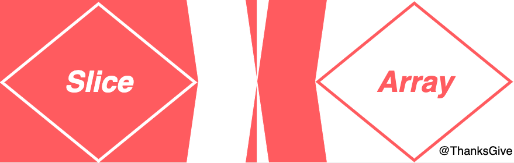

# Go Slice 源码解析

## Slice 与 Array
 

### Array(数组)
* 优势：
* * 长度固定，使得其在内存中是连续存储的，查询更为高效；
* * 存储上除了数据本身没有额外元信息数据，内存更加紧凑；
* 劣势：
* * 不可变长度，限制了其使用范围，在复杂的实际应用环境中无法动态加载调整大小；
* * 数组长度本身也是其类型的一部分，例如：[5]int 和 [10]int 是两种不同的类型，这在函数传参时需要特别注意；
* * 数组是值类型，赋值 和 函数传参都会复制整个数组数据，如果数据量过大，将造成大量不必要的内存消耗（注意：就算使用 数组指针进行函数传参，那本质上也是 值传递，相对于是 copy 一个 指针的副本进行传参，只不过是副本指针也是指向的同源底层数组，所以也能修改源数组的数据）；
```go
func fk2(a [1e7]int) {
	var m runtime.MemStats
	runtime.ReadMemStats(&m)
	fmt.Println("3 --- func Alloc: ", m.Alloc)
}
func main() {
	var m runtime.MemStats
	runtime.ReadMemStats(&m)
	fmt.Println("1 --- Alloc: ", m.Alloc)
	var a [1e7]int
	for i := 0; i < len(a); i++ {
		a[i] = i
	}
	runtime.ReadMemStats(&m)
	fmt.Println("2 --- Alloc: ", m.Alloc)
	fk2(a)
}
/* 
1 --- Alloc:  106664
2 --- Alloc:  80115736
3 --- func Alloc:  80117040
*/
```
### Slice(切片)
* 优势：
* * 动态大小，适配于更加广度的应用范围(容量大小的变化会基于扩容机制动态变更，可以一定程度上避免频繁的 底层数组的复制 与 重新分配，可以降低性能消耗)；
* * 函数传参时更为高效，因为它只涉及到表侧的 slice 结构体传递(64位系统下，默认 24 bytes)；
* * 共享底层数组，多个切片可以共享一个底层数组的不同部分，这使得在某些场景下(如从大数据集中提取子集)更加高效；
* 劣势：
* * 额外的元数据消耗，切片额外需要维护一个表侧的引用结构体，用于管理底层的数组数据；
* * 潜在的内存泄漏风险；
```go

var a []int

const needNum = 1

func fk13(b *[]int) {
	a = (*b)[:needNum]

	/* for i := 0; i < needNum; i++ {
		a = append(a, (*b)[i])
	} */
}

func sliceMemoryLeak() {
	var m runtime.MemStats

	runtime.ReadMemStats(&m)
	fmt.Printf("0 ------ allocated memory: %d bytes\n", m.Alloc)

	largeSlice := make([]int, 1e7)
	for i := range largeSlice {
		largeSlice[i] = i
	}

	runtime.ReadMemStats(&m)
	fmt.Printf("1 ------ allocated memory: %d bytes\n", m.Alloc)

	fk13(&largeSlice)

	largeSlice = nil
	runtime.GC()

	runtime.ReadMemStats(&m)
	fmt.Printf("2 ---[ after largeSlice = nil ]--- allocated memory: %d bytes\n", m.Alloc)

	fmt.Println("a ------> : ", a)

	a = nil
	runtime.GC()

	runtime.ReadMemStats(&m)
	fmt.Printf("3 ---[ after a = nil ]--- allocated memory: %d bytes\n", m.Alloc)
}
func main() {
	sliceMemoryLeak()
}
/* 
0 ------ allocated memory: 108312 bytes
1 ------ allocated memory: 80115560 bytes
2 ---[ after largeSlice = nil ]--- allocated memory: 80115560 bytes
a ------> :  [0]
3 ---[ after a = nil ]--- allocated memory: 112648 bytes
*/
```
上述代码实例模拟了 slice 的内存泄漏情况。当存在 全局变量时，这时对函数中调度的切片形成一个引用( a = (*b)[:needNum] ), 这样会造成一种很糟糕的情况( 那就是当 main 中的 原切片引用置为 nil 并 手动触发 GC，结果发现 内存依旧没有被释放 --- 如此便造成了内存泄漏了 )，而原因便是 存在某一变量仍引用着底层数组数据，哪怕仅仅只是只引用了一个元素，golang 的 GC 管理器也会认为此数据仍处于使用状态，如此就会造成，实际上已无用的内存数据，因存在不当的引用 而 无法得到释放。

而在函数中 想要完全隔绝与 源底层数组数据的关系，从而安全地获取数据的方案，比如：利用一个空容量的切片对象，然后使用 append，利用切片的扩容机制，底层数组在容量不足时会主动进行扩容（分配一个新容量的新数组，然后将数据复制到新数组中），如此便让两者的数据完全分离开了。
```go
// 替换上面 fk13 函数 并 再次运行查看结果
// a = (*b)[:needNum]
for i := 0; i < needNum; i++ {
	a = append(a, (*b)[i])
}
/* 
0 ------ allocated memory: 106456 bytes
1 ------ allocated memory: 80115560 bytes
2 ---[ after largeSlice = nil ]--- allocated memory: 112488 bytes
a ------> :  [0]
3 ---[ after a = nil ]--- allocated memory: 112560 bytes
*/
```

上面我们分析了 array 与 slice 的优劣，下面我们将基于源码来解析 slice 的实现原理，我们可以分为几个模块来进行分析
* 1、slice 的结构体
* 2、slice 的初始化
* 3、slice 的扩容机制
* 4、slice 的拷贝

## Slice 的 结构体

## Slice 的初始化

## Slice 的扩容机制

## Slice 的拷贝
