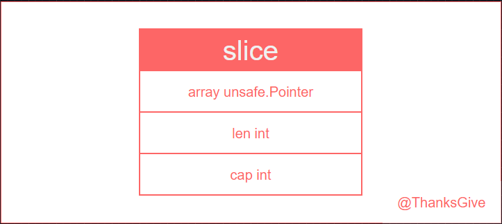
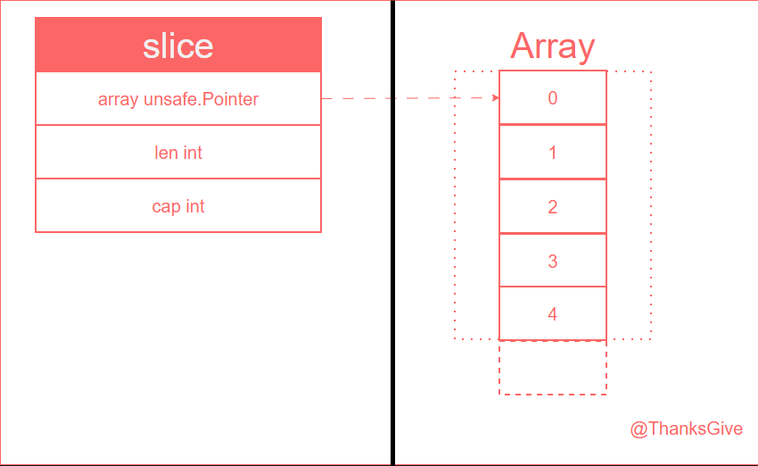

# Go Slice 源码解析

## Slice 与 Array
 

### Array(数组)
* 优势：
* * 长度固定，使得其在内存中是连续存储的，查询更为高效；
* * 存储上除了数据本身没有额外元信息数据，内存更加紧凑；
* 劣势：
* * 不可变长度，限制了其使用范围，在复杂的实际应用环境中无法动态加载调整大小；
* * 数组长度本身也是其类型的一部分，例如：[5]int 和 [10]int 是两种不同的类型，这在函数传参时需要特别注意；
* * 数组是值类型，赋值 和 函数传参都会复制整个数组数据，如果数据量过大，将造成大量不必要的内存消耗（注意：就算使用 数组指针进行函数传参，那本质上也是 值传递，相对于是 copy 一个 指针的副本进行传参，只不过是副本指针也是指向的同源底层数组，所以也能修改源数组的数据）；
```go
func fk2(a [1e7]int) {
	var m runtime.MemStats
	runtime.ReadMemStats(&m)
	fmt.Println("3 --- func Alloc: ", m.Alloc)
}
func main() {
	var m runtime.MemStats
	runtime.ReadMemStats(&m)
	fmt.Println("1 --- Alloc: ", m.Alloc)
	var a [1e7]int
	for i := 0; i < len(a); i++ {
		a[i] = i
	}
	runtime.ReadMemStats(&m)
	fmt.Println("2 --- Alloc: ", m.Alloc)
	fk2(a)
}
/* 
1 --- Alloc:  106664
2 --- Alloc:  80115736
3 --- func Alloc:  80117040
*/
```
### Slice(切片)
* 优势：
* * 动态大小，适配于更加广度的应用范围(容量大小的变化会基于扩容机制动态变更，可以一定程度上避免频繁的 底层数组的复制 与 重新分配，可以降低性能消耗)；
* * 函数传参时更为高效，因为它只涉及到表侧的 slice 结构体传递(64位系统下，默认 24 bytes)；
* * 共享底层数组，多个切片可以共享一个底层数组的不同部分，这使得在某些场景下(如从大数据集中提取子集)更加高效；
* 劣势：
* * 额外的元数据消耗，切片额外需要维护一个表侧的引用结构体，用于管理底层的数组数据；
* * 潜在的内存泄漏风险；
```go

var a []int

const needNum = 1

func fk13(b *[]int) {
	a = (*b)[:needNum]

	/* for i := 0; i < needNum; i++ {
		a = append(a, (*b)[i])
	} */
}

func sliceMemoryLeak() {
	var m runtime.MemStats

	runtime.ReadMemStats(&m)
	fmt.Printf("0 ------ allocated memory: %d bytes\n", m.Alloc)

	largeSlice := make([]int, 1e7)
	for i := range largeSlice {
		largeSlice[i] = i
	}

	runtime.ReadMemStats(&m)
	fmt.Printf("1 ------ allocated memory: %d bytes\n", m.Alloc)

	fk13(&largeSlice)

	largeSlice = nil
	runtime.GC()

	runtime.ReadMemStats(&m)
	fmt.Printf("2 ---[ after largeSlice = nil ]--- allocated memory: %d bytes\n", m.Alloc)

	fmt.Println("a ------> : ", a)

	a = nil
	runtime.GC()

	runtime.ReadMemStats(&m)
	fmt.Printf("3 ---[ after a = nil ]--- allocated memory: %d bytes\n", m.Alloc)
}
func main() {
	sliceMemoryLeak()
}
/* 
0 ------ allocated memory: 108312 bytes
1 ------ allocated memory: 80115560 bytes
2 ---[ after largeSlice = nil ]--- allocated memory: 80115560 bytes
a ------> :  [0]
3 ---[ after a = nil ]--- allocated memory: 112648 bytes
*/
```
上述代码实例模拟了 slice 的内存泄漏情况。当存在 全局变量时，这时对函数中调度的切片形成一个引用( a = (*b)[:needNum] ), 这样会造成一种很糟糕的情况( 那就是当 main 中的 原切片引用置为 nil 并 手动触发 GC，结果发现 内存依旧没有被释放 --- 如此便造成了内存泄漏了 )，而原因便是 存在某一变量仍引用着底层数组数据，哪怕仅仅只是只引用了一个元素，golang 的 GC 管理器也会认为此数据仍处于使用状态，如此就会造成，实际上已无用的内存数据，因存在不当的引用 而 无法得到释放。

而在函数中 想要完全隔绝与 源底层数组数据的关系，从而安全地获取数据的方案，比如：利用一个空容量的切片对象，然后使用 append，利用切片的扩容机制，底层数组在容量不足时会主动进行扩容（分配一个新容量的新数组，然后将数据复制到新数组中），如此便让两者的数据完全分离开了。
```go
// 替换上面 fk13 函数 并 再次运行查看结果
// a = (*b)[:needNum]
for i := 0; i < needNum; i++ {
	a = append(a, (*b)[i])
}
/* 
0 ------ allocated memory: 106456 bytes
1 ------ allocated memory: 80115560 bytes
2 ---[ after largeSlice = nil ]--- allocated memory: 112488 bytes
a ------> :  [0]
3 ---[ after a = nil ]--- allocated memory: 112560 bytes
*/
```

上面我们分析了 array 与 slice 的优劣，下面我们将基于源码来解析 slice 的实现原理，我们可以分为几个模块来进行分析
* 1、slice 的结构体
* 2、slice 的初始化
* 3、slice 的扩容机制
* 4、slice 的拷贝

## Slice 的 结构体



让我们先打开 slice 的源码 ：src/runtime/slice.go
```go
type slice struct {
	array unsafe.Pointer // 指向底层数组的指针
	len   int // 当前底层数组的长度
	cap   int // 当前底层数组的容量
}
/* 
注意：始终需要保证 len <= cap
*/
```
从源码中我们知晓了， 切片的本身是一个复合的结构体。通过一个指针引用底层数组，这样可以直接封装数组指针的功能，让开发者在使用体感上可以无缝贴合数组，再加上一个数组长度 和 一个数组容量，这两个字段可为切片的扩容机制服务，从而使切片得以升华为 动态扩容 的模式

在我们对 slice 的封装结构有了一个认识后，我们通过一个代码实例来进一步加深一下，同时也为后续的创建流程抛砖引玉一下
```go
/* 
	现在创建一个 len=5，cap=6 的切片。请试想如下问题：
		1、当前可访问的长度是 5 还是 6 ？
		2、当前底层数组的size是多少 bytes？（友情提示：int 在 64位系统中 8 bytes）

*/
func main() {
	s := make([]int, 5, 6)
	fmt.Println("s[4]: ", s[4]) // 可访问长度5, [0-4] ?
	fmt.Println("s[5]: ", s[5]) // 可访问长度6, [0-5] ?
	fmt.Println("s - len : ", len(s), " cap: ", cap(s))

	// 获取底层数组的指针
	sPtr := (*[6]int)(unsafe.Pointer(&s[0]))
	// 计算底层数组的大小
	sSize := unsafe.Sizeof(*sPtr)
	fmt.Println("sSize: ", sSize)
}
/* 
s[4]:  0
// s[5] -------> 越界了
s - len :  5  cap:  6
sSize:  48
*/
```
第一个问题，应该很好理解，长度为5，那么自然只能方位 s[0] - s[4]。
但这样就有个疑问了，我只初始化了 5 个长度的数据，为什么数组的大小是 48 = 6 * 8 呢？
这就是由 切片的 make 初始化创建过程决定了，让我们继续往下看。
## Slice 的初始化

```go
/* 
et *_type : _type 的指针，用以表示底层数组元素的类型，_type 是所有类型最原始的元信息
len, cap int : len - 底层数组的长度     cap - 底层数组的容量
*/
func makeslice(et *_type, len, cap int) unsafe.Pointer {
	/* 
		math.MulUintptr : et.size 和 uintptr(cap) 的乘积 ---> 所想申请的最大内存容量
		et.size: 类型元素的字节大小
		uintptr(cap): 将容量转化为 uintptr 类型

		overflow: 乘积是否 大于了 uintptr的最大值(系统可分配的最大内存)
	*/
	mem, overflow := math.MulUintptr(et.size, uintptr(cap))
	// 判定 容量是否超载了 或 len 是否无效
	if overflow || mem > maxAlloc || len < 0 || len > cap {
		// NOTE: Produce a 'len out of range' error instead of a
		// 'cap out of range' error when someone does make([]T, bignumber).
		// 'cap out of range' is true too, but since the cap is only being
		// supplied implicitly, saying len is clearer.
		// See golang.org/issue/4085.
		// 容量申请内存是爆了，再checke 一下 len 申请的结果(保证: len <= cap)
		mem, overflow := math.MulUintptr(et.size, uintptr(len))
		if overflow || mem > maxAlloc || len < 0 {
			panicmakeslicelen()
		}
		panicmakeslicecap()
	}
	// cap 和 len 都是有效数值，使用 垃圾回收分配器 mallocgc 分配内存
	return mallocgc(mem, et, true)
}
```
上面从源码角度解析了 切片的 make 创建初始化逻辑。

我们由此也知晓了 [ s := make([]int, 5, 6) ] 的大小为什么是 48 = 6 * 8。因为内存分配时是根据容量的数值，预先就分配完成了的，只是还未使用而已。

而在 slice 的创建写法上的差异，而存在两种不同的概念：
* nil切片 ： 一个 [ 未初始化 ]的切片，其值为 nil，长度 和 容量 均为 0
* 空切片 ： 一个[ 已初始化 ]的切片，但这个切片不包含元素，其容量和长度也为0，但内存其实已经给其分配底层数组了，因为其指针已经被赋值了。
```go
func fkk() {
	// 定义一个 nil 切片
	var nilSlice []int
	// 定义一个 空 切片
	emptySlice := make([]int, 0)
	emptySliceLiteral := []int{}

	fmt.Printf("Nil Slice: %v, len: %d, cap: %d, address: %p\n", nilSlice, len(nilSlice), cap(nilSlice), nilSlice)
	fmt.Printf("Empty Slice(make): %v, len: %d, cap: %d, address: %p\n", emptySlice, len(emptySlice), cap(emptySlice), emptySlice)
	fmt.Printf("Empty Slice(Literal): %v, len: %d, cap: %d, address: %p\n", emptySliceLiteral, len(emptySliceLiteral), cap(emptySliceLiteral), emptySliceLiteral)
}
/* 
Nil Slice: [], len: 0, cap: 0, address: 0x0
Empty Slice(make): [], len: 0, cap: 0, address: 0x56c090
Empty Slice(Literal): [], len: 0, cap: 0, address: 0x56c090
*/
```
## Slice 的扩容机制
在了解了 slice 的初始化创建流程后，我们将进入 slice 有别于普通数组的最大优势：动态扩容，至于该如何理解这个动态扩容机制，我们将从源码角度，一步步进行分析
```go
/* 
input params：
	oldPtr unsafe.Pointer : 指向当前切片底层数组的指针
	newLen int : 新长度，等于旧长度 + 新添加的元素数量( oldLen + num ) 
	oldCap int : 原始切片的容量
	num int : 正在添加的元素数量
	et *_type : 元素类型

output params：
	slice ： 重新分配的新的 slice
		slice{ 
			p: 一个重新分配的底层数据 
			newLen: 新长度，等于旧长度 + 新添加的元素数量( oldLen + num ) 
			newcap: 基于扩容机制扩容后的新容量
		}
*/
func growslice(oldPtr unsafe.Pointer, newLen, oldCap, num int, et *_type) slice {
	// 获取添加元素前的底层数组长度
	oldLen := newLen - num
	// 进行一些有关 协程 和 内存的判定
	if raceenabled {
		// racereadrangepc：用于检测并报告在多个 Go 协程中访问同一内存区域时可能发生的数据竞争问题 
		callerpc := getcallerpc()
		racereadrangepc(oldPtr, uintptr(oldLen*int(et.size)), callerpc, abi.FuncPCABIInternal(growslice))
	}
	if msanenabled {
		// msanread: 用于在使用内存消毒工具（Memory Sanitizer 简称 MSan）时标记读取的内存，并发现存在内存错误时报告此类问题 
		msanread(oldPtr, uintptr(oldLen*int(et.size)))
	}
	if asanenabled {
		// asanread: 用于在使用地址消毒工具（Address Sanitizer 简称 ASan）时标记读取的内存，并发现存在内存错误时报告此类问题 
		asanread(oldPtr, uintptr(oldLen*int(et.size)))
	}

	// 切片长度不能为负数，这是一个基本的约束条件
	if newLen < 0 {
		panic(errorString("growslice: len out of range"))
	}

	/* 
		这里对元素类型大小为 0 的特殊处理（例如：切片类型是一个 空结构体 类型）
		下文注释中提示：不应该创建一个指针为空 但长度非零 的切片。为了避免这种情况，代码使用了一个特殊的全局变量 zerobase 来提供非零指针。unsafe.Pointer(&zerobase) 是一个非零地址，确保切片的底层指针不为 nil
	*/
	if et.size == 0 {
		// append should not create a slice with nil pointer but non-zero len.
		// We assume that append doesn't need to preserve oldPtr in this case.
		return slice{unsafe.Pointer(&zerobase), newLen, newLen}
	}

	// 开始 slice 的扩容策略 -------->>>
	// newcap 初始设置为 当前容量(oldCap)
	newcap := oldCap
	// doublecap 基于当前容量的双倍化
	doublecap := newcap + newcap
	if newLen > doublecap {
		// 如果 新长度(newLen) 大于了 doublecap，则 新容量(newcap) 直接赋值为 新长度(newLen)，保证完全容纳新增数据
		// 一次性扩容量大于了两倍有余，这样的情况不再做过多处理，因为在常规数据处理中，这样的情况应该是不常见的，直接进行快速扩容，简单而高效 
		newcap = newLen
	} else {
		// 一个 阈值常量，用于判定是否进行 小切片扩容机制
		// 256 这个数值是基于Google实验的结果，确保在 大切片 和 小切片 的扩容机制中保持平衡
		const threshold = 256
		if oldCap < threshold {
			// 如果 当前容量(oldCap) 小于 阈值常量(threshold)，则直接将 新容量(newCap) 设置为当前容量的两倍，触发小切片的快速扩容机制 
			newcap = doublecap
		} else {
			// 如果 当前容量(oldCap) 大于等于 阈值常量(threshold)，则进行 大切片扩容机制

			// Check 0 < newcap to detect overflow
			// and prevent an infinite loop.
			// 使用 for 循环逐步增加 newcap，直到其至少能够容纳 newLen 。每次增长比例约为 1.25 倍
			for 0 < newcap && newcap < newLen {
				// Transition from growing 2x for small slices
				// to growing 1.25x for large slices. This formula
				// gives a smooth-ish transition between the two.
				newcap += (newcap + 3*threshold) / 4
			}
			// Set newcap to the requested cap when
			// the newcap calculation overflowed.
			// 如果数值溢出了，则直接赋值成 newLen
			if newcap <= 0 {
				newcap = newLen
			}
		}
	}
 
	// 在计算出新的容量后，需要根据 元素大小(et.size) 来计算出最后的内存大小并处理好可能造成的内存溢出情况 ----> 
	// 用于标识计算新容量时是否发生了溢出
	var overflow bool
	/* 
		lenmem: 当前长度的字节数（oldLen）
		newlenmem: 新长度的字节数（newLen = oldLen + num）
		capmem：新容量的字节数（newcap）
	*/
	var lenmem, newlenmem, capmem uintptr
	// Specialize for common values of et.size.（为常见的 et.size 值进行特化）
	
	// For 1 we don't need any division/multiplication.（对于值为1的情况，不需要进行任何处理，乘除都无所谓）
	
	// For goarch.PtrSize（指针大小）, compiler will optimize division/multiplication into a shift by a constant.（对于指针大小，编译器将乘除法优化为按常数移位操作 ）
	// 解析一下：如果 et.size 的值是指针大小（32系统是: 4 | 64位系统是: 8），编译器可以将与该值的除法或乘法优化为位移操作（例如，乘以 4 可以通过左移两位实现），这样可以提高计算效率。

	// For powers of 2, use a variable shift.（对于 2 的幂次，使用变量移位操作）
	// 解析一下：如果 et.size 是 2 的幂次（例如 2、4、8 等），可以使用位移操作来代替乘法或除法，因为位移操作比乘法或除法更高效。例如，乘以 8 可以通过左移三位实现。

	switch {
	case et.size == 1:
		// 元素size为 1 时，直接使用长度 和 容量
		lenmem = uintptr(oldLen)
		newlenmem = uintptr(newLen)
		capmem = roundupsize(uintptr(newcap)) // roundupsize: 返回当请求某个大小的内存时，mallocgc 将实际分配的内存块大小。
		overflow = uintptr(newcap) > maxAlloc
		newcap = int(capmem)
	case et.size == goarch.PtrSize:
		// size = 8 (64位系统) 或 4 (32位系统) 
		lenmem = uintptr(oldLen) * goarch.PtrSize
		newlenmem = uintptr(newLen) * goarch.PtrSize
		capmem = roundupsize(uintptr(newcap) * goarch.PtrSize)
		/* 
			uintptr: 一种无符号整数类型，足够大以保存指针值
			maxAlloc/goarch.PtrSize ：系统最大字节数 / 系统指针大小 = 系统可以分配的最大对象数量
			所以 新容量的数量值 > 系统可以分配的最大对象数量 ---> 则意味着溢出了
		*/
		overflow = uintptr(newcap) > maxAlloc/goarch.PtrSize
		// 根据核算后的实际内存大小重新计算容量
		newcap = int(capmem / goarch.PtrSize)
	case isPowerOfTwo(et.size):
		// size = 2的次幂，使用移位操作来替代乘除法
		// shift : 用于标识 移位的位数
		var shift uintptr
		if goarch.PtrSize == 8 { // 判定是 64位 或 32位 系统
			// Mask shift for better code generation.
			/* 
			sys.TrailingZeros64 : 用于计算一个64位无符号整数 x 的末尾零位数的函数
			例如：
				0 : ----------------> 末尾零位数: 64 (全是0)
				2 :  10    		----> 末尾零位数: 1 ---> 左移 1 位 == 乘 2
				4 :  100    	----> 末尾零位数: 2 ---> 左移 2 位 == 乘 4
				8 :  1000    	----> 末尾零位数: 3 ---> 左移 3 位 == 乘 8
				16 : 10000    	----> 末尾零位数: 4 ---> 左移 4 位 == 乘 16
--------------------------------------------------------------------------
				`et.size`的尾随零的数量 与 63 按位与，确保结果在 0-63 之间 
				63 的二进制是: 111111
				按位与 --- 两边同时为 1 结果为 1，所以保证了结果必在 0-63 之间				
			*/
			shift = uintptr(sys.TrailingZeros64(uint64(et.size))) & 63
		} else {
			// 同理，`et.size`的尾随零的数量 与 31 按位与，确保结果在 0-31 之间 
			shift = uintptr(sys.TrailingZeros32(uint32(et.size))) & 31
		}
		lenmem = uintptr(oldLen) << shift
		newlenmem = uintptr(newLen) << shift
		capmem = roundupsize(uintptr(newcap) << shift)
		// (maxAlloc >> shift) ：当前可以生成的最大对象数量
		overflow = uintptr(newcap) > (maxAlloc >> shift)
		// 基于 实际内存容量 重新生成 新容量
		newcap = int(capmem >> shift)
		// 基于 新容量 计算 新容量的字节数
		capmem = uintptr(newcap) << shift
	default:
	// 排除了 size 为 1 或 goarch.PtrSize 或 2的次幂，直接基于 size 进行乘除运算
		lenmem = uintptr(oldLen) * et.size
		newlenmem = uintptr(newLen) * et.size
		capmem, overflow = math.MulUintptr(et.size, uintptr(newcap))
		capmem = roundupsize(capmem)
		newcap = int(capmem / et.size)
		capmem = uintptr(newcap) * et.size
	}

	// The check of overflow in addition to capmem > maxAlloc is needed
	// to prevent an overflow which can be used to trigger a segfault
	// on 32bit architectures with this example program:
	//
	// type T [1<<27 + 1]int64
	//
	// var d T
	// var s []T
	//
	// func main() {
	//   s = append(s, d, d, d, d)
	//   print(len(s), "\n")
	// }
	// 标记溢出 或 当前容量字节数大于了系统最大字节数 --- 触发 panic
	if overflow || capmem > maxAlloc {
		panic(errorString("growslice: len out of range"))
	}
	// 用于指向新分配的底层数组
	var p unsafe.Pointer
	// ptrdata 表示类型中指针数据的大小，为 0，说明类型中没有指针数据
	if et.ptrdata == 0 {
		/* 
			mallocgc: 分配内存
				capmem: 基于新容量来分配内存
				nil：没有指针数据，所以第二个参数为 nil
				false：表示不需要清零分配内存
		*/
		p = mallocgc(capmem, nil, false)
		// The append() that calls growslice is going to overwrite from oldLen to newLen.（append() 调用 growslice 会从 oldLen 到 newLen 进行覆盖）
		// Only clear the part that will not be overwritten.（因此只需要清零不会被覆盖的部分）
		// The reflect_growslice() that calls growslice will manually clear
		// the region not cleared here.（ reflect_growslice() 会手动清除未在这里清除的区域）
		
		/* 
			memclrNoHeapPointers 清除没有指针的数据
				add(p, newlenmem)：计算需要清零的起始位置
				capmem-newlenmem：计算需要清零的字节数（新容量字节数 - 新长度字节数）
		*/ 
		memclrNoHeapPointers(add(p, newlenmem), capmem-newlenmem)
	} else {
		// Note: can't use rawmem (which avoids zeroing of memory), because then GC can scan uninitialized memory.（不能使用 rawmem。rawmem 会避免清零内存，而后，GC（垃圾回收器）可能会扫描未初始化的内存，导致错误）
		/* 
			mallocgc: 分配内存
				capmem: 基于新容量来分配内存
				et：有指针数据，第二个参数表示：指向类型信息的指针（如果类型信息为nil，表示分配的是不包含指针的内存）
				true：表示需要清零分配内存
		*/
		p = mallocgc(capmem, et, true)
		// lenmen > 0: 源长度大于0，说明源切片中存在数据
		// 写屏蔽是否启用：保证源切片中不会再插入任何数据，保证数据的有效性
		if lenmem > 0 && writeBarrier.enabled {
			// Only shade the pointers in oldPtr since we know the destination slice p
			// only contains nil pointers because it has been cleared during alloc.
			// 调用bulkBarrierPreWriteSrcOnly函数，为源切片oldPtr中的指针设置写屏障，因为目标切片p在分配时已被清理，包含的仅是nil指针。
			bulkBarrierPreWriteSrcOnly(uintptr(p), uintptr(oldPtr), lenmem-et.size+et.ptrdata)
		}
	}
	// 调用memmove函数，将oldPtr指向的lenmem字节的内存复制到新分配的内存p中。
	memmove(p, oldPtr, lenmem)

	return slice{p, newLen, newcap}
}
```
在我们整体梳理了扩容的源码后，为了进一步加深理解，我们可以通过以下代码实例来进行巩固

### 扩容策略 的 实际数值体现
```go
func growslice(newLen, oldCap int) int {
	newcap := oldCap
	doublecap := newcap + newcap
	if newLen > doublecap {
		newcap = newLen
	} else {
		const threshold = 256
		if oldCap < threshold {
			// 如果 当前容量(oldCap) 小于 阈值常量(threshold)，则直接将 新容量(newCap) 设置为当前容量的两倍，触发小切片的快速扩容机制
			newcap = doublecap
		} else {
			// 使用 for 循环逐步增加 newcap，直到其至少能够容纳 newLen 。每次增长比例约为 1.25 倍
			for 0 < newcap && newcap < newLen {
				newcap += (newcap + 3*threshold) / 4
			}
			// 如果数值溢出了，则直接赋值成 newLen
			if newcap <= 0 {
				newcap = newLen
			}
		}
	}
	return newcap
}

func main() {
	rand.Seed(time.Now().UnixNano())
	var cap int = 8
	for i := 1; i <= 10; i++ {
		cap = cap * i
		num := rand.Intn(100)
		newLen := cap + num
		newCap := growslice(newLen, cap)
		fmt.Printf("oldCap: %d, addNum: %d, newLen: %d, newCap: %d, newCap/oldCap: %.2f\n", cap, num, newLen, newCap, (float64(newCap) / float64(cap)))
	}
}
/* 
oldCap: 8, addNum: 36, newLen: 44, newCap: 44, newCap/oldCap: 5.50
oldCap: 16, addNum: 85, newLen: 101, newCap: 101, newCap/oldCap: 6.31
oldCap: 48, addNum: 58, newLen: 106, newCap: 106, newCap/oldCap: 2.21
oldCap: 192, addNum: 87, newLen: 279, newCap: 384, newCap/oldCap: 2.00
oldCap: 960, addNum: 95, newLen: 1055, newCap: 1392, newCap/oldCap: 1.45
oldCap: 5760, addNum: 97, newLen: 5857, newCap: 7392, newCap/oldCap: 1.28
oldCap: 40320, addNum: 45, newLen: 40365, newCap: 50592, newCap/oldCap: 1.25
oldCap: 322560, addNum: 3, newLen: 322563, newCap: 403392, newCap/oldCap: 1.25
oldCap: 2903040, addNum: 54, newLen: 2903094, newCap: 3628992, newCap/oldCap: 1.25
oldCap: 29030400, addNum: 36, newLen: 29030436, newCap: 36288192, newCap/oldCap: 1.25
*/
```
通过上述的代码实例输出，我们可以更加清晰地将对 slice 的扩容机制进行一下总结：
* 1、如果 新长度(newLen) 大于 doublecap，则 【新容量(newcap) 直接赋值为 新长度(newLen)】
* 2、否则，如果 新长度(newLen) 小于等于 doublecap ---> 进入大小切片扩容机制
* * 2.1、如果 当前容量(oldCap) 小于 阈值常量(threshold=256)，则 将 【新容量(newcap) 设置为当前容量的两倍】
* * 2.2、如果 当前容量(oldCap) 大于等于 阈值常量(threshold=256)，则 【使用 for 循环逐步增加 新容量(newcap)，直到其至少能够容纳 新长度(newLen)，每次增长的比例约为 1.25 倍】
## Slice 的拷贝
