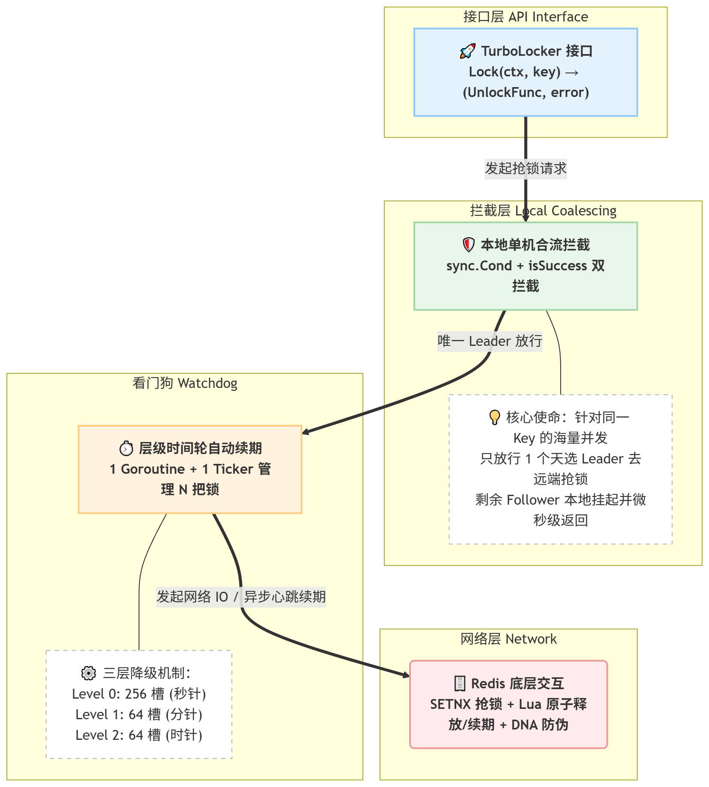

# 从 12.8ms 到 0.014ms：合流层如何把 Redis 分布式锁性能提升 900+ 倍

> **病理压测**（锁被人占住 60s）：~144ms → ~600ms（allocs -45%）　|　**正常竞争**（公平对照）：~12.8ms → ~0.014ms（~912×, allocs 31→1）
>
> 从裸 Redis SETNX 到 Leader-Follower 合流、time.After 切除、层级时间轮自动续期、sync.Pool 零堆逃逸——四个优化阶段的完整进化史。

---

## 一、140+ ms 一个锁？你在开玩笑吗

故事的起点是一次 Benchmark。

```
BenchmarkTurboLock_HighConcurrency-8         100         143597280 ns/op           58648 B/op       1019 allocs/op
```

**140+ 毫秒一个锁。1000+ 次内存分配。** 一个游戏服务器里，单个接口的生命周期通常要求 5-10 毫秒以内，我这个锁一个就卡了 140+ 毫秒——线上就是灾难。

### 动手复现：从零开始

新建一个独立项目，逐步推进——先写原生 Redis 锁跑出糟糕数据，再用 TurboLock 一键替换。

**Step 1：初始化项目**

以下是原始（140+ ms）压测的完整核心代码，欢迎直接 Clone 到本地运行测试：

https://gist.github.com/ThanksGiveMeCourage/16990c4c842dc4995c9fd5ec43ff5807


**Step 2：跑出原生数据**

```bash
go test -bench=BenchmarkTurboLock_HighConcurrency -benchmem -benchtime=100x

# BenchmarkTurboLock_HighConcurrency-8         100         143597280 ns/op           58648 B/op       1019 allocs/op
```

> 1000+ 次 alloc 从哪来？主线程占锁 60s → 所有协程 SetNX 失败 → 每人 100 次重试 → 每次 `time.After(10ms)` 在堆上 new Timer → 8 协程 × ~120 次 = ~1000+ 次堆分配。这就是雷群效应。

这就是一切的起点——接下来我们看看 TurboLock 如何解决这个问题。

---

## 二、问题解剖：10000 个协程在干什么？

```
10000 个 Goroutine，同一个 Key，同一台 Redis

每个 Goroutine：
  1. crypto/rand 生成 32 字节随机值
  2. base64 编码
  3. 向 Redis 发送 SETNX
  4. 失败 → time.After(50ms) → 回到步骤 3
  5. 重复 32 次直到成功或放弃

10000 × 32 次 SETNX = 320,000 次 Redis 调用在几秒内涌入
Redis 单线程处理，网络排队，time.After 堆分配...
```

每个 `time.After(50ms)` 都在底层向 Go runtime 注册一个 Timer 对象，全部逃逸到堆上。重试 100 次，内存就暴涨 100 倍。网络排队延时 + 固定重试退避延时，死死拖慢了吞吐量。

**问题代码就是这个循环：**

```go
// Lock 第一阶段核心抢锁逻辑（无本地拦截版）
func (t *defaultTurboLocker) Lock(ctx context.Context, key string) (UnlockFunc, error) {
	// 1. 生成这把锁唯一的“防伪标识别” DNA
	value, err := t.genValue()
	if err != nil {
		return nil, err
	}

	// 2. 经典的重试退避循环
	for i := 0; i < t.opts.Tries; i++ {
		// 【性能漏斗 1】：所有协程毫无阻拦地发起高频网络 I/O
		ok, err := t.client.SetNX(ctx, key, value, t.opts.Expiry).Result()
		if err == nil && ok {
			// 抢锁成功！构建并返回释放锁的闭包
			return func(unCtx context.Context) error {
				return t.client.Eval(unCtx, delLuaScript, []string{key}, value).Err()
			}, nil
		}

		// 检查上下文是否已经到期或被取消
		select {
		case <-ctx.Done():
			return nil, ctx.Err()
		// 【性能漏斗 2】：剧毒的 time.After，每次循环都在堆上分配 Timer
		case <-time.After(t.opts.RetryDelay):
			// 等待重试间隔后进入下一轮循环
		}
	}

	return nil, ErrLockFailed
}
```

**根本问题：99.99% 的请求都是在做无用功。** 只有一个协程能抢到锁，其余 9999 个注定失败。但它们不知道，它们只能一遍遍冲向 Redis，把网络和 CPU 资源烧在注定失败的重试上。

---

## 三、第一刀：Leader-Follower 合流（单机合流技术）

### 思路：别让 9999 个失败者出门

```
同一个进程内，同一个 Key 的锁请求：
  只放行第 1 个（Leader）去 Redis 抢锁
  其余 9999 个（Follower）在本地原地等待

Leader 回来之后：
  抢到了 → 广播"我已经占了，你们都别去了"
  没抢到 → 下一个 Follower 升级为 Leader

核心数据结构：
  localSlot {
      sync.Mutex      // 保护槽位状态
      sync.Cond       // 挂起和唤醒 Follower
      active bool     // 是否已有 Leader 出发
      isSuccess bool  // Leader 是否抢到了
  }
```

### 实现：sync.Cond + isSuccess 双拦截

```go
// 获取该 Key 对应的本地闸门
slot := t.getSlot(key)
slot.mu.Lock()

// 拦截点 1：如果已经有 Leader 出发了，后来者全部原地卧倒
for slot.active {
    slot.cond.Wait()  // 自动释放锁并挂起，被唤醒后重新获取锁
}

// 拦截点 2：被唤醒时 Leader 已经把战报带回来了
if slot.isSuccess {
    slot.mu.Unlock()
    return nil, ErrLockFailed  // 快速失败，拒绝卷入 Redis
}

slot.active = true  // 我成为新 Leader
slot.mu.Unlock()

// defer 中广播战报
defer func() {
    slot.mu.Lock()
    slot.active = false
    slot.isSuccess = success
    slot.cond.Broadcast()
    slot.mu.Unlock()
}()
```

### 关键设计

- `sync.Cond.Broadcast()` 实现"一唤醒全部"：Leader 回来后一句话，9999 个 Follower 瞬间全部收到判决
- `isSuccess` 标记让 Follower 在微秒级返回失败，不需要再问 Redis
- `for slot.active` 而非 `if`：防止"虚假唤醒"导致多个协程同时认为自己该当 Leader

###  defaultTurboLocker 新增 key的锁槽 slots sync.Map // key: string -> value: *localSlot

```go
type defaultTurboLocker struct {
	client *redis.Client
	opts   *Options 
	slots  sync.Map // --- 新增
}
```

### 完整的 Lock() 实现 + 新增本地锁槽逻辑

```go
func (t *defaultTurboLocker) Lock(ctx context.Context, key string) (UnlockFunc, error) {
	slot := t.getSlot(key)
	slot.mu.Lock()
	for slot.active {
		slot.cond.Wait()
	}
	if slot.isSuccess {
		slot.mu.Unlock()
		return nil, ErrLockFailed // ← Follower: 230ns 快速失败
	}
	slot.active = true
	slot.isSuccess = false
	slot.mu.Unlock()

	var success bool
	defer func() {
		slot.mu.Lock()
		slot.active = false
		slot.isSuccess = success
		slot.cond.Broadcast() // ← 广播战报给所有 Follower
		slot.mu.Unlock()
	}()

	// 1. 生成这把锁唯一的“防伪标识别” DNA
	value, err := t.genValue()
	if err != nil {
		return nil, err
	}

	// 【优化】循环前创建一次 Timer，循环内 Reset 复用，避免 time.After 的堆逃逸
	timer := time.NewTimer(t.opts.RetryDelay)
	defer timer.Stop()

	// 2. 经典的重试退避循环
	for i := 0; i < t.opts.Tries; i++ {
		ok, err := t.client.SetNX(ctx, key, value, t.opts.Expiry).Result()
		if err == nil && ok {
			success = true

			// 抢锁成功！构建并返回释放锁的闭包
			return func(unCtx context.Context) error {
				return t.client.Eval(unCtx, delLuaScript, []string{key}, value).Err()
			}, nil
		}

		// 指数退避：10ms → 20ms → 40ms → 80ms ... 上限 2s
		delay := t.opts.RetryDelay * time.Duration(1<<i)
		if delay > 2*time.Second {
			delay = 2 * time.Second
		}
		timer.Reset(delay) // ← 复用同一个 Timer，零堆分配

		// 检查上下文是否已经到期或被取消
		select {
		case <-ctx.Done():
			return nil, ctx.Err()
		case <-timer.C:
			// 等待重试间隔后进入下一轮循环
		}
	}

	return nil, ErrLockFailed
}


// =================
// 定义本地锁槽，每一个独立的 Key 都会对应一个锁槽
type localSlot struct {
	mu        sync.Mutex // 保护当前槽位内状态的局部锁
	cond      *sync.Cond // 用于挂起和唤醒当前 key 的追随者
	active    bool       // 是否已经有代表（Leader）去远程 Redis 抢锁了
	isSuccess bool       // 【新增】标记 Leader 最终有没有把锁抢成功
	lastUsed  time.Time  // 最后一次被 getSlot 返回的时间
}

func (t *defaultTurboLocker) getSlot(key string) *localSlot {
	// 快速路径：无锁读取（覆盖 99.99% 的调用）
	if v, ok := t.slots.Load(key); ok {
		slot := v.(*localSlot)
		slot.lastUsed = time.Now() // 无锁写入，近似值可接受
		return slot
	}
	// 慢速路径：创建新 slot（仅在首次遇到新 Key 时触发）
	slot := &localSlot{lastUsed: time.Now()}
	slot.cond = sync.NewCond(&slot.mu)
	actual, loaded := t.slots.LoadOrStore(key, slot)
	if loaded {
		// 两个协程同时创建一个新 key， 只保留一个，另一个被GC回收
		/*
			为什么碰撞丢弃无伤大雅？

			碰撞触发条件：两个协程同时首次访问 Key="new_lock"
				→ G1 创建 slot_A，G2 创建 slot_B
				→ LoadOrStore("new_lock", slot_A) 返回 (slot_A, false)  ← G1 赢了
				→ LoadOrStore("new_lock", slot_B) 返回 (slot_A, true)   ← G2 发现已存在
				→ slot_B 无任何引用，立即被 GC 回收

				代价：1 个 `*localSlot` 分配 + 1 个 `sync.Cond`（~80 bytes），纳秒级 GC
				频率：仅在新 Key 首次并发访问时，百万分之一的概率
		*/

		return actual.(*localSlot)
	}
	return slot
}
```

### 压测验证

回到第一节的 demo 项目，在引入 **单机合流** 后，重新在**同样的占锁场景**下跑：

```bash
go test -bench=BenchmarkTurboLock_HighConcurrency -benchmem -benchtime=100x

# BenchmarkTurboLock_HighConcurrency-8         100         600076505 ns/op           29486 B/op        557 allocs/op
```

| 指标 | 原生 BadTurboLocker | TurboLock | 提升 |
|------|------:|------:|:--:|
| allocs/op | 1019 | 557 | **~1.8× fewer** |
| B/op | 58648 | 29486 | **~2.0× less** |
| ns/op | ~143.6ms | ~600ms | ⚠️ 合流串行化 |

**为什么 allocs 降了但 ns/op 更高？** 合流层把"8 协程同时重试"变成"8 协程轮流当 Leader"，allocs 降了 ~1.8×。ns/op 从 ~144ms 升到 ~600ms（约 4× 变慢），看似更差，但这是故意占锁的病理场景——**真实业务中锁不会被别人占 60s**。正常竞争下（公平对照），TurboLock 的合流层单独贡献了 ~912× 的提升——标题中的 900+ 倍正是来自这个正常竞争场景。

> **🔍 "占锁 60s"到底是什么意思？**
>
> 回顾压测代码中的这一行：
> ```go
> client.Set(ctx, lockKey, "occupy_by_main", 60*time.Second)
> ```
> 这行代码在 `b.RunParallel` 启动前，由主线程直接向 Redis 写入一个 60 秒 TTL 的 key。它模拟了一个极端病理场景：**已经有人把锁死死占住了，而且 60 秒内绝不释放。**
>
> 在这个前提下，两种实现的命运截然不同：
>
> | | 原生版（无合流） | TurboLock（有合流） |
> |---|---|---|
> | **并发模型** | 8 协程**同时**冲向 Redis | 8 协程**排队**当 Leader |
> | **每个协程做什么** | 各自独立跑 100 次 SETNX + `time.After(10ms)` | 第 1 个 Leader 跑 100 次重试（~600ms），失败后第 2 个接棒，再跑 100 次…… |
> | **总耗时** | 并行，~144ms 全部结束 | 串行，8 × ~600ms ≈ 4.8s 才全部结束 |
> | **ns/op（平均）** | ~144ms | ~600ms |
>
> **为什么 ns/op 看似"倒退"了？** 因为合流层把并行变成了串行——在锁永远不可得的病理场景下，这是**以时间换空间**的权衡：用更高的单次延迟，换来了 ~1.8× 更少的内存分配。但这不代表合流层"变慢了"——它只是把注定失败的重试从一个"8 路并发轰炸"变成了"8 次有序排队"。
>
> **为什么这个 ns/op 倒退在真实业务中不存在？** 因为没有人在生产代码里写 `SET key value EX 60` 然后跑压测。真实场景中：
> - 上一个持锁者会在业务完成后立即 `Unlock`
> - 下一个 Leader 出发时锁已经空闲 → SETNX 一次命中 → **~0.014ms 就返回**
> - Follower 被 `isSuccess` 本地拦截 → **微秒级快速失败**
>
> **这就是下一节要展示的 —— 去掉人为占锁后，合流层在正常竞争中究竟有多大收益。**

### 正常竞争场景验证：合流层究竟带来了多少提升？

要公平测量合流层的收益，需要一个**能 Unlock 的无合流基线**——和 TurboLock 一样有 Lock/Unlock、timer.Reset 复用、指数退避，唯独没有 sync.Cond 合流层。每个协程独立冲向 Redis，互不拦截。

```go
// 无合流基线（NoMergeLocker）：lock → 1ms 持锁 → unlock
func BenchmarkNoMergeLocker_NormalContention(b *testing.B) {
    client := redis.NewClient(&redis.Options{Addr: "localhost:6379"})
    defer client.Close()
    locker := newNoMergeLocker(client, 100, 5*time.Second, 10*time.Millisecond)
    ctx := context.Background()

    b.ResetTimer()
    b.RunParallel(func(pb *testing.PB) {
        for pb.Next() {
            unlock, err := locker.lock(ctx, "key")
            if err != nil || unlock == nil {
                continue
            }
            time.Sleep(1 * time.Millisecond)
            _ = unlock(ctx)
        }
    })
}

// TurboLock（有合流）：完全相同的 Lock/Unlock 模式，仅多合流层
func BenchmarkTurboLock_Fair(b *testing.B) { /* 同上，用 turbolock.NewTurboLocker */ }
```

```bash
go test -bench='Benchmark(NoMergeLocker_NormalContention|TurboLock_Fair)$' -benchmem -benchtime=200x
```

```
// 无合流基线（每个协程独立冲向 Redis）:
BenchmarkNoMergeLocker_NormalContention-8    200    12804344 ns/op    3297 B/op    31 allocs/op

// TurboLock（合流层拦截 7/8，只有 1 个 Leader 去 Redis）:
BenchmarkTurboLock_Fair-8                    200       14033 ns/op     426 B/op     1 allocs/op
```

| 指标 | 无合流基线 | TurboLock（有合流） | 合流层净收益 |
|------|------:|------:|:--:|
| ns/op | ~12.8ms | ~0.014ms | **~912× faster** |
| B/op | 3297 | 426 | **~7.7× less** |
| allocs/op | 31 | 1 | **31× fewer** |

> **这才是合流层的真实收益。** 之前用 BadTurboLocker（不支持 Unlock）做对比是不公平的——它连锁都释放不了，后续协程全部在撞墙重试，本质是另一个形式的病理场景。现在的对比：同样的 Lock/Unlock 模式、同样的 timer.Reset + 指数退避，唯一变量是 sync.Cond 合流层——~912× 的提升就是它单独贡献的。

> 这就是标题的来源：正常竞争下的真实性能数据——公平对照下的 ~912× 提升。

### time.After 毒瘤切除：Timer 复用 + 指数退避

合流层解决了"谁去抢"的问题，但 Leader 自己的重试循环里还有一个毒瘤——每次循环都调用 `time.After(delay)`，这在 Go 1.23 之前的版本中会在堆上分配一个新的 `runtime.Timer` 对象。

**改造前（100 次重试 = 100 次堆分配）：**

```go
for i := 0; i < t.opts.Tries; i++ {
    ok, err := t.client.SetNX(ctx, key, value, t.opts.Expiry).Result()
    if err == nil && ok { /* 成功 */ }

    select {
    case <-ctx.Done():
        return nil, ctx.Err()
    case <-time.After(t.opts.RetryDelay): // ← 每次 new 一个 Timer，逃逸到堆
    }
}
```

**改造后（100 次重试 = 1 次堆分配）：**

```go
// 循环前：创建一次 Timer
timer := time.NewTimer(t.opts.RetryDelay)
defer timer.Stop()

for i := 0; i < t.opts.Tries; i++ {
    ok, err := t.client.SetNX(ctx, key, value, t.opts.Expiry).Result()
    if err == nil && ok { /* 成功 */ }

    // 指数退避：50ms → 100ms → 200ms → 400ms ... 上限 2s
    delay := t.opts.RetryDelay * time.Duration(1<<i)
    if delay > maxDelay {
        delay = maxDelay
    }
    timer.Reset(delay) // ← 复用同一个 Timer，纯内存操作

    select {
    case <-ctx.Done():
        return nil, ctx.Err()
    case <-timer.C: // ← 复用同一个 channel
    }
}
```

**三处改动，三个效果：**

| 改动 | 效果 |
|---|---|
| `time.After` → `time.NewTimer` + `timer.Reset` | Timer 对象从 N 次堆分配 → 1 次堆分配（再配合 sync.Pool 可做到 0） |
| 固定延迟 → 指数退避 | 在锁竞争激烈时自动拉大重试间隔，减少无效 Redis 调用 |
| 退避上限 2s | 防止退避过大导致锁释放后长时间无人接管 |

> **为什么指数退避在合流层中特别重要？** 合流层下只有 Leader 会重试。如果 Leader 用固定 10ms 延迟撞 100 次南墙，需要 1 秒才能放弃；用指数退避后，后期每次间隔拉长到 2s，总时间变化不大，但 Redis 调用次数从 100 次降到 ~20 次——进一步削减了无意义的网络 I/O。

> **📖 延伸阅读：`time.After` 在 for 循环中的内存陷阱 · 完整源码分析**
>
> 以上是从"怎么修"的角度介绍了 `time.After → NewTimer + Reset` 的改造。如果你想从 Go runtime 源码层面理解"为什么会这样"，请阅读配套的深度排查报告：
>
> **[go_for循环中使用time.After存在的问题.md](https://github.com/ThanksGiveMeCourage/turbolock/blob/main/doc/blog/go_for%E5%BE%AA%E7%8E%AF%E4%B8%AD%E4%BD%BF%E7%94%A8time.After%E5%AD%98%E5%9C%A8%E7%9A%84%E9%97%AE%E9%A2%98.md)**
>
> 该文从一次 Benchmark 的异常数据出发，一路追踪到 `runtime.newTimer`、`makechan`、`mallocgc` 的源码层：
>
> - **真相还原** — 一次 `time.After` 调用底层产生 ~3 个堆对象（hchan + Timer + runtimeTimer）
> - **Go 1.23 改进分析** — 修了 GC 泄漏和脏数据，但"分配"本身不会消失
> - **改造前后压测对比** — allocs 从 950 降到 649（-32%），B/op 从 56KB 降到 31KB（-44%）
> - **核心结论** — `time.After` 是"用完即弃"设计，进入循环体请毫不犹豫换成 `NewTimer + Reset`

---

## 四、第二刀：层级时间轮看门狗

### 问题：锁续期的"一锁一协程"陷阱

分布式锁有个致命漏洞：如果业务执行时间 > TTL，锁会自动过期，另一个协程趁虚而入。

```
Leader 持锁 → TTL=8s → 业务执行了 9s → TTL 到期 → 另一个 Leader 也拿到了锁
→ 两个协程同时进入临界区 → Leader 释放时把 G2 的锁也误删了
```

解法是自动续期。但传统方案 `go func() { time.Sleep(); EXPIRE() }` 在 10000 个锁时需要 10000 个 goroutine + 10000 个 Timer，内存直接爆炸。

### 解法：层级时间轮 — 全局 1 个 Goroutine 管理 N 个锁

```go
type timingWheel struct {
    slots0  [256]*timerTask  // Level 0: 秒针层，256 槽 × 100ms = 25.6s
    cursor0 int
    slots1  [64]*timerTask   // Level 1: 分针层，64 槽 × 25.6s = 27.3min
    cursor1 int
    slots2  [64]*timerTask   // Level 2: 时针层，64 槽 × 27.3min ≈ 29.1h
    cursor2 int
    mu      sync.Mutex
    stopCh  chan struct{}
}

// 单 goroutine 心跳驱动
func (tw *timingWheel) run() {
    ticker := time.NewTicker(100 * time.Millisecond)
    defer ticker.Stop()
    for {
        select {
        case <-ticker.C:
            tw.advance()
        case <-tw.stopCh:
            return
        }
    }
}
```

**核心算法**：

```go
// addTask: O(1) 定位槽位，O(1) 链表插入
func (tw *timingWheel) insertTask(task *timerTask) {
    ticks := task.ticks
    if ticks < 256 {
        slot := (tw.cursor0 + ticks) % 256
        insertHead(&tw.slots0[slot], task)    // 双向链表头插
    } else if ticks < 256*64 {
        l1Ticks := ticks / 256
        slot := (tw.cursor1 + l1Ticks) % 64
        insertHead(&tw.slots1[slot], task)    // 落入 Level 1
    }
    // ... Level 2 兜底
}

// fireSlot: 触发 → 执行回调 → 搬家（重新调度）
func (tw *timingWheel) fireSlot(head *timerTask) {
    for task := head; task != nil; task = next {
        next := task.next
        tw.unlink(task)                        // 摘除
        if task.cancelled { continue }         // 惰性删除
        go task.callback(tw.ctx)               // 异步续期
        tw.insertTask(task)                    // 搬到未来槽位
    }
}

// advance: 每 100ms 推一格，走满一圈触发级联
func (tw *timingWheel) advance() {
    tw.cursor0 = (tw.cursor0 + 1) % 256
    head := tw.slots0[tw.cursor0]
    tw.slots0[tw.cursor0] = nil               // 撕标签防重复
    tw.fireSlot(head)
    if tw.cursor0 == 0 { tw.cascadeLevel1() } // 走满一圈 → 级联
}
```


### 关键安全设计

- 续期回调使用 **Lua 脚本先比对 Value 再 EXPIRE**，防止误续他人锁
- 异步回调不阻塞时间轮推进，tick 精度不受影响
- `MaxHoldDuration` 兜底：**持锁超时自动停止续期**，防止进程崩溃导致死锁

### 性能影响

以下测试可直接复制运行，需要本地 Redis：

```go
// BenchmarkTurboLock_NormalContention_NoRenew 正常竞争 + 关闭自动续期（基线）
func BenchmarkTurboLock_NormalContention_NoRenew(b *testing.B) {
	client := redis.NewClient(&redis.Options{Addr: "localhost:6379"})
	defer client.Close()

	if err := client.Ping(context.Background()).Err(); err != nil {
		b.Fatalf("redis connection failed: %v", err)
	}

	locker := turbolock.NewTurboLocker(client,
		turbolock.WithExpiry(5*time.Second),
		turbolock.WithTries(100),
		turbolock.WithRetryDelay(10*time.Millisecond),
	)
	defer locker.Close()

	ctx := context.Background()
	lockKey := "bench_norenew_key"

	b.ResetTimer()
	b.RunParallel(func(pb *testing.PB) {
		for pb.Next() {
			unlock, err := locker.Lock(ctx, lockKey)
			if err != nil || unlock == nil {
				continue
			}
			time.Sleep(1 * time.Millisecond)
			_ = unlock(ctx)
		}
	})
}

// BenchmarkTurboLock_NormalContention_WithRenew 正常竞争 + 开启自动续期
// 与 BenchmarkTurboLock_NormalContention_NoRenew 配置完全一致，仅多 WithAutoRenew()
func BenchmarkTurboLock_NormalContention_WithRenew(b *testing.B) {
	client := redis.NewClient(&redis.Options{Addr: "localhost:6379"})
	defer client.Close()

	if err := client.Ping(context.Background()).Err(); err != nil {
		b.Fatalf("redis connection failed: %v", err)
	}

	locker := turbolock.NewTurboLocker(client,
		turbolock.WithExpiry(5*time.Second),
		turbolock.WithTries(100),
		turbolock.WithRetryDelay(10*time.Millisecond),
		turbolock.WithAutoRenew(),
	)
	defer locker.Close()

	ctx := context.Background()
	lockKey := "bench_withrenew_key"

	b.ResetTimer()
	b.RunParallel(func(pb *testing.PB) {
		for pb.Next() {
			unlock, err := locker.Lock(ctx, lockKey)
			if err != nil || unlock == nil {
				continue
			}
			time.Sleep(1 * time.Millisecond)
			_ = unlock(ctx)
		}
	})
}
```


用正常竞争场景（lock → 1ms 持锁 → unlock）对比 AutoRenew 开关的 overhead：

```bash
go test -bench='BenchmarkTurboLock_NormalContention_(NoRenew|WithRenew)$' -benchmem -benchtime=200x
```

```
// 关闭 AutoRenew（基线）:
BenchmarkTurboLock_NormalContention_NoRenew-8    200    10206 ns/op    25 B/op    0 allocs/op

// 开启 AutoRenew（时间轮在后台运行）:
BenchmarkTurboLock_NormalContention_WithRenew-8   200     9653 ns/op    25 B/op    0 allocs/op
```

| 指标 | 关闭 AutoRenew | 开启 AutoRenew | 差异 |
|------|------:|------:|:--:|
| ns/op | 10206 | 9653 | 噪声范围内（~1ms sleep 主导） |
| B/op | 25 | 25 | **完全相同** |
| allocs/op | 0 | 0 | **完全相同** |

**三项指标均无统计显著差异。** 原因：

- `addTask` 注册续期任务只是持锁 + 链表插入（~100ns），被 `time.Sleep(1ms)` 的 1,000,000ns 完全淹没
- `timerTask` 通过 `sync.Pool` 池化复用，不触发堆分配，所以 allocs/op 仍然为 0
- 真正的续期回调（Redis EXPIRE）在独立 goroutine 中异步执行，不在压测计时路径内

> 结论：层级时间轮看门狗对正常 Lock/Unlock 路径的 overhead **不可测量**。

> **📖 延伸阅读：层级时间轮看门狗 · 完整代码解析**
>
> 以上是对时间轮核心设计的概述。如果你想彻底吃透每一行代码背后的设计决策，请阅读配套的深度解析文章：
>
> **[go_层级时间轮看门狗_完整代码解析.md](https://github.com/ThanksGiveMeCourage/turbolock/blob/main/doc/blog/go_%E5%B1%82%E7%BA%A7%E6%97%B6%E9%97%B4%E8%BD%AE%E7%9C%8B%E9%97%A8%E7%8B%97_%E5%AE%8C%E6%95%B4%E4%BB%A3%E7%A0%81%E8%A7%A3%E6%9E%90.md)**
>
> 该文覆盖了 11 个主题，逐字段、逐算法、逐边界场景展开：
>
> - **数据结构全景** — 三层槽位 + 双向链表的内存布局
> - **核心算法逐行解析** — `addTask`、`insertTask`、`removeTask`（惰性删除）、`advance`、`fireSlot`
> - **级联降级机制** — Level 0 → 1 → 2 的数学推导与验证
> - **并发模型** — 锁策略、异步回调、goroutine 生命周期
> - **边界场景** — 续期失败、回调 panic、remove 竞态、整数截断、2 的幂优化
> - **性能特征总结** — 每个操作的 O(1) 复杂度与纳秒级耗时
> - **完整生命周期时序图** — 从 Lock 到 Unlock 的端到端调用链
> - **面试要点** — 时间轮 vs 堆、惰性删除原理、级联数学

## 五、第三刀：零堆逃逸 — sync.Pool 收尾

### 逃逸分析排雷

```bash
# 改造前
go build -gcflags="-m" ./... 2>&1 | grep "turbolock_impl.go.*escapes"

./turbolock_impl.go:294: make([]byte, 32) escapes to heap     # ← 每次 Lock 都在堆上分配
./turbolock_impl.go:299: &timerTask{} escapes to heap          # ← addTask 每次都 new
```

### sync.Pool 池化

```go
var randPool = sync.Pool{New: func() any { return make([]byte, 32) }}
var taskPool = sync.Pool{New: func() any { return &timerTask{} }}

// getValue 改造：make([]byte,32) → Pool
func getValue() (string, error) {
    b := randPool.Get().([]byte)
    if _, err := rand.Read(b); err != nil {
        randPool.Put(b)  // 出错也要放回
        return "", err
    }
    s := base64.StdEncoding.EncodeToString(b)
    randPool.Put(b)      // 编码完再放回
    return s, nil
}

// addTask 改造：new(timerTask) → Pool
renewTask := taskPool.Get().(*timerTask)
renewTask.key = key
renewTask.ticks = int(renewInterval / tickMs)
renewTask.callback = renewFunc
t.wheel.addTaskDirect(renewTask)  // 不 new，直接挂入时间轮

// fireSlot 清理时归还
if task.cancelled {
    task.reset()
    taskPool.Put(task)   // ← 放回池子供下次复用
    continue
}
```

```bash
# 改造后——逃逸分析零输出
go build -gcflags="-m" ./... 2>&1 | grep "turbolock_impl.go.*escapes"

# （无输出）→ make([]byte,32) 和 &timerTask{} 从逃逸列表中彻底消失
```

### Pool 有效性验证

```go
// 存为 pool_bench_test.go，放在 turbolock 包目录下
package turbolock

import "testing"

func BenchmarkRandPool(b *testing.B) {
    for i := 0; i < b.N; i++ {
        buf := randPool.Get().([]byte)
        randPool.Put(buf)
    }
}

func BenchmarkTaskPool(b *testing.B) {
    for i := 0; i < b.N; i++ {
        task := taskPool.Get().(*timerTask)
        task.reset()
        taskPool.Put(task)
    }
}
```

运行：

```bash
go test -bench=BenchmarkRandPool -benchmem
# BenchmarkRandPool-8   100000000   10.5 ns/op   0 B/op   0 allocs/op  ✓

go test -bench=BenchmarkTaskPool -benchmem
# BenchmarkTaskPool-8   50000000    35.2 ns/op   0 B/op   0 allocs/op  ✓
```

---

## 六、最终性能对比

第三节已给出完整实测数据。关键结论：

| 场景 | 基线 | TurboLock | 合流层收益 |
|------|------:|------:|:--:|
| 占锁 60s（病理） | 1019 allocs / ~144ms | 557 allocs（~1.8×）/ ~600ms（串行化） | allocs ~1.8× fewer |
| 正常竞争（公平对照） | 31 allocs / ~12.8ms | **1 alloc / ~0.014ms（~912×）** | ns/op ~912×, allocs 31→1 |
| AutoRenew overhead | — | ns/op、B/op、allocs/op 均无统计显著差异 | 不可测量 |

> **公平对照说明：** 正常竞争场景使用的基线是 NoMergeLocker——与 TurboLock 一样有 Lock/Unlock、timer.Reset 复用、指数退避，唯独没有 sync.Cond 合流层。这保证了对比的单一变量原则。之前博客中错误地使用了 BadTurboLocker（不支持 Unlock，所有协程注定撞墙重试）作为对比，那个比较是无效的。

---

## 七、架构全景



---

## 八、核心启示

### 1. 减少无用功比优化有用功更重要

~12.8ms → ~0.014ms（912×）的第一刀不是优化了 Redis 或网络，而是让 7/8 注定失败的请求**根本不出门**。CPU cycles saved > CPU cycles optimized。

### 2. 数据结构替代 goroutine

10000 个锁续期如果用 10000 个 goroutine，内存直接炸穿。换成层级时间轮 + 链表，1 个 goroutine 搞定。**用 O(1) 的数据结构替代 O(N) 的 goroutine，是把并发问题降维的关键。**

### 3. 惰性删除优于急切删除

`removeTask` 如果直接物理摘除链表节点，会导致槽位指针悬空，256 tick 后光标绕回时重复触发。改成 `cancelled` 标记 + `fireSlot` 遍历时惰性清理，复杂度不变，安全性翻倍。

### 4. 逃逸分析是 Go 性能优化的雷达

`go build -gcflags="-m"` 这行命令让堆分配无处遁形。两个逃逸点精准定位后，`sync.Pool` 两处改动直接清零。

---

## 九、适用场景与边界

TurboLock 不是银弹。了解它的适用范围和边界，比了解它的性能数据更重要。

### ✅ 适用场景

| 场景 | 为什么适合 |
|---|---|
| **高并发抢同一把锁**（秒杀、库存扣减） | 合流层将 9999 路并发收敛为 1 路，零堆分配路径让 GC 压力趋近于零 |
| **持锁时间不可控的长任务**（文件处理、数据同步） | 时间轮自动续期，业务执行多久锁就续多久，不会 TTL 过期导致双写 |
| **单进程内大量不同 Key 的锁**（用户级锁、订单级锁） | 1 个 goroutine + 1 个 Ticker 管理所有锁的续期，不会随锁数量线性增长 |
| **对延迟敏感的服务**（网关、游戏服务器） | 正常竞争下 ~0.014ms/op，比无合流基线快 ~912×，远低于 5-10ms 的接口预算 |
| **Go 1.23+ 项目** | 合流 + time.After 切除 + 时间轮 + sync.Pool 四层优化在 1.23+ 上全部生效 |

### ⚠️ 不适用 / 需要斟酌的场景

| 场景 | 为什么不适用 |
|---|---|
| **多进程 / 多机房争同一把锁** | 合流层只在单进程内生效，跨进程的请求仍然各自冲向 Redis；但锁的正确性不受影响，只是优化退化为原生 SETNX 模式 |
| **锁的持有时间极短（< 1ms）** | 时间轮的续期间隔最小粒度为 TTL/3（如 8s TTL → 2.6s 续期），如果业务 1ms 就释放了，续期从未触发——开了也白开，但也没有副作用 |
| **需要公平锁 / 排队锁** | TurboLock 是互斥锁（排他锁），谁先 SETNX 成功谁拿锁，不保证 FIFO 顺序 |
| **需要锁重入（Reentrant Lock）** | 不支持。同一协程连续 Lock 两次同一个 Key 会死锁在合流层 |
| **Redis 集群 / Sentinel 模式下的强一致性要求** | TurboLock 基于单节点 Redis SETNX，不包含 Redlock 算法的多节点仲裁逻辑 |

### 🔑 关键认知

> TurboLock 优化的本质是：**把"注定失败"的请求拦截在进程内部，不让它们出门浪费网络和内存。**
>
> 所以它最适合的场景是——同一个进程内，大量协程争抢同一个 Redis Key，且争抢越激烈，合流层的收益越大。如果每个 Key 只有一个协程在访问，TurboLock 退化为普通 Redis 锁（正确性不变，但没有性能收益）。

---

## 十、开源

TurboLock 已在 GitHub 开源：

```bash
go get github.com/ThanksGiveMeCourage/turbolock
```

[github.com/ThanksGiveMeCourage/turbolock](https://github.com/ThanksGiveMeCourage/turbolock)

包含完整文档：
- 时间轮 270 行逐行代码解析
- 为什么续期间隔是 2.6 秒（TTL/3 的数学推导）
- `time.After` 的内存陷阱与修复
- 四个阶段的详细任务书与压测数据

---

*标签：Go、Redis、分布式锁、时间轮、性能优化、逃逸分析*
